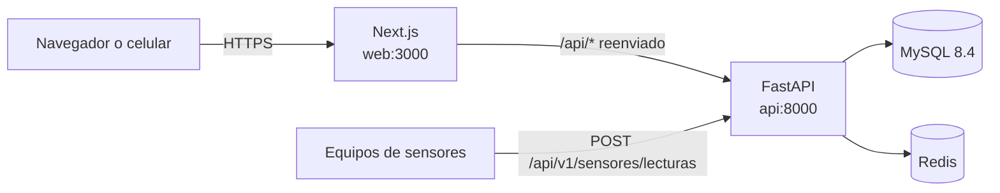

# AVISENA

**Sistema web para la gestión de granjas avícolas.** Lleva en un solo lugar las aves, la producción de
huevos, los sensores de los galpones, el inventario, las ventas con su caja, las tareas del personal y
los reportes, para una o varias fincas y para varias empresas a la vez.


📘 **[Manual de usuario completo](docs/manual/MANUAL_DE_USUARIO.md)** — cómo usar cada pantalla, paso a paso.

---

## Contenido

- [Qué hace](#qué-hace)
- [Capturas](#capturas)
- [Tecnologías](#tecnologías)
- [Arquitectura](#arquitectura)
- [Instalación con Docker](#instalación-con-docker)
- [Instalación sin Docker](#instalación-sin-docker)
- [Datos de ejemplo](#datos-de-ejemplo)
- [Variables de entorno](#variables-de-entorno)
- [Conectar los sensores](#conectar-los-sensores)
- [Pruebas](#pruebas)
- [Estructura del proyecto](#estructura-del-proyecto)
- [Cómo funcionan los accesos](#cómo-funcionan-los-accesos)
- [Reglas del negocio](#reglas-del-negocio)
- [Seguridad](#seguridad)
- [Poner en un servidor](#poner-en-un-servidor)
- [Solución de problemas](#solución-de-problemas)
- [Versión anterior](#versión-anterior)
- [Autor](#autor)

---

## Qué hace

| Módulo | Funciones |
|---|---|
| **Cuentas y fincas** | Varias empresas (o personas) en el mismo sistema, cada una con sus fincas y sus datos totalmente separados |
| **Galpones y lotes** | Galpones con capacidad y ocupación; lotes con raza, edad y costo; mortalidad, descarte, ventas, fugas, traslados; cierre del lote |
| **Producción de huevos** | Recolección diaria por tipo (Super, AAA, AA, A, B, sucios, rotos), porcentaje de postura y huevos disponibles |
| **Sanidad** | Vacunas, medicamentos, vitaminas y desinfecciones, con próximo refuerzo y descuento de la bodega |
| **Alimento y pesajes** | Alimento entregado por lote (descuenta del inventario y suma al costo), pesajes con peso promedio |
| **Sensores** | Temperatura, humedad, amoníaco, CO₂, luz, agua y silo; estado en tiempo real, historial filtrable por días y gráfica con el rango normal |
| **Inventario** | Bodega central y bodegas por finca; entradas, salidas, traslados y ajustes por conteo; costo promedio; stock mínimo |
| **Ventas y caja** | Puntos de venta con numeración propia, productos por presentación, historial de precios, apertura y cierre de caja, descuentos en porcentaje con tope, varias formas de pago, anulaciones |
| **Tareas y rutinas** | Tareas del día con responsable y prioridad; rutinas diarias, semanales o mensuales |
| **Novedades** | Daños, clima, plagas, cortes de servicios, robos y salud del lote, con gravedad, costo y cierre |
| **Avisos** | Campana con stock bajo, sensores fuera de rango, refuerzos, tareas atrasadas, novedades graves y cajas sin cerrar; se cierran solos |
| **Reportes** | Producción, ventas, aves, alimento y pendientes por periodo; descarga en CSV para Excel |
| **Importar desde Excel** | Sube el archivo con su propio formato, empareja columnas, revisa antes de guardar y deshace si hace falta |
| **Usuarios y permisos** | Seis roles con permisos editables por módulo (ver, crear, editar, borrar) |
| **Registro de cambios** | Quién hizo qué, cuándo y en qué finca |
| **Celular** | Diseño adaptable e instalable como aplicación (PWA) |

---

## Capturas

| Historial de un sensor | Caja |
|---|---|
|  |  |

| Detalle de un lote | Avisos |
|---|---|
|  |  |

| En el celular | Menú en el celular |
|---|---|
|  |  |

Todas las pantallas están en el [manual de usuario](docs/manual/MANUAL_DE_USUARIO.md).

---

## Tecnologías

**Backend (`api/`)**

- Python 3.11, **FastAPI**, Pydantic v2
- **SQLAlchemy 2** (modelos tipados) y **Alembic** (migraciones)
- **MySQL 8.4** con PyMySQL
- JWT (python-jose) + token de refresco en cookie `HttpOnly`; contraseñas con bcrypt
- **Redis** para limitar intentos de inicio de sesión (con respaldo en memoria)
- openpyxl para leer Excel
- pytest (110 pruebas contra MySQL real)

**Frontend (`web/`)**

- **Next.js 15** (App Router) con **TypeScript**
- **Tailwind CSS 4**
- sonner (notificaciones), gráficas propias en SVG
- PWA: manifiesto e íconos para instalarla en el celular

**Infraestructura**

- **Docker Compose**: base de datos, caché, API y web
- Flujo de GitHub Actions listo para correr las pruebas (`docs/github-actions-pruebas.yml`)

---

## Arquitectura



- La web llama a la API por `/api` en el mismo dominio y Next.js reenvía esas rutas al backend. Así la
  cookie de sesión funciona sin configurar CORS.
- Cada petición lleva el token de acceso y la **finca activa** (`X-Finca-Id`). La API valida en cada
  operación el rol, el permiso del módulo y que la finca pertenezca a la cuenta del usuario.
- Las reglas del negocio viven en `api/app/servicios/`; las rutas solo reciben, validan y responden.
- La documentación interactiva de la API queda en `http://localhost:8000/docs`.

---

## Instalación con Docker

**Requisitos:** [Docker Desktop](https://www.docker.com/products/docker-desktop/) (Windows o macOS) o
Docker Engine con Compose (Linux), y Git.

```bash
# 1. Descargar el proyecto
git clone https://github.com/Breiner1412/AVISENA.git
cd AVISENA

# 2. Crear el archivo de configuración y cambiar las contraseñas
cp .env.example .env          # en Windows (PowerShell): copy .env.example .env

# 3. Construir y levantar todo
docker compose -f docker-compose.v2.yml up -d --build

# 4. Ver que todo esté arriba (api y db deben decir "healthy")
docker compose -f docker-compose.v2.yml ps
```

Abre:

| Qué | Dirección |
|---|---|
| Aplicación | http://localhost:3000 |
| Documentación de la API | http://localhost:8000/docs |

Entra con el `ADMIN_EMAIL` y el `ADMIN_PASSWORD` del `.env`. La primera vez el sistema crea solo las
tablas, los módulos, los roles, los permisos, el usuario de plataforma y una cuenta con una finca de
ejemplo para empezar.

### Comandos útiles

| Acción | Comando |
|---|---|
| Ver los registros de la API | `docker compose -f docker-compose.v2.yml logs -f api` |
| Detener | `docker compose -f docker-compose.v2.yml down` |
| Empezar de cero (**borra la base de datos**) | `docker compose -f docker-compose.v2.yml down -v` |
| Actualizar después de un cambio en el código | `docker compose -f docker-compose.v2.yml up -d --build` |
| Reiniciar la contraseña del admin | `docker compose -f docker-compose.v2.yml exec api python -m app.semilla --reiniciar-admin` |
| Restaurar los permisos de fábrica | `docker compose -f docker-compose.v2.yml exec api python -m app.semilla --forzar-permisos` |
| Cargar datos de ejemplo | `docker compose -f docker-compose.v2.yml exec api python -m app.demo` |

---

## Instalación sin Docker

**Requisitos:** Python 3.11, Node.js 22, MySQL 8 y (opcional) Redis.

```bash
# --- API ---
cd api
cp .env.example .env                     # ajusta DB_HOST=127.0.0.1 y los datos de tu MySQL
python -m venv .venv
. .venv/bin/activate                     # Windows: .venv\Scripts\activate
pip install -r requirements-dev.txt
alembic upgrade head                     # crea las tablas
python -m app.semilla                    # módulos, roles, permisos y usuario admin
uvicorn app.main:app --reload            # http://localhost:8000

# --- Web (en otra terminal) ---
cd web
npm install
npm run dev                              # http://localhost:3000
```

Si la API no está en `http://localhost:8000`, indica dónde con la variable `API_INTERNA` antes de
`npm run dev`.

---

## Datos de ejemplo

Para ver el sistema como si una granja llevara **seis meses** usándolo:

```bash
docker compose -f docker-compose.v2.yml exec api python -m app.demo
# sin Docker: cd api && python -m app.demo
```

Tarda unos 3 minutos y crea la cuenta **Granja Avícola La Esperanza** con:

- 2 fincas: *La Esperanza* (gallinas ponedoras) y *El Recreo* (pollo de engorde)
- 6 galpones, 11 lotes (incluido un lote viejo que se descarta y unas pollitas que pasan a postura)
- 7 usuarios con todos los roles
- ~180 días de recolección de huevos, alimento, mortalidad, pesajes, vacunas y desinfecciones
- ~2.900 ventas con su caja diaria, descuentos, pagos por transferencia y algunas anulaciones
- compras, traslados, salidas y conteos de inventario
- rutinas y tareas diarias, novedades y ~20.000 mediciones de 9 sensores

Todo se registra con las mismas reglas del sistema, así que el inventario, las aves y las cajas cuadran.

| Usuario | Rol |
|---|---|
| `dueno@demo-avisena.com` | Propietario |
| `admin@demo-avisena.com` | Administrador |
| `supervisor@demo-avisena.com` | Supervisor |
| `operario1@demo-avisena.com` | Operario |
| `caja@demo-avisena.com` | Cajero |

Contraseña de todos: **`Granja2026`**. Los datos se cargan una sola vez por base de datos; para volver a
cargarlos hay que empezar de cero (`down -v`).

---

## Variables de entorno

Se configuran en el archivo `.env` (copia de `.env.example`). **Nunca subas el `.env` al repositorio** y
no uses el signo `$` en las contraseñas: Docker Compose lo interpreta como variable.

| Variable | Para qué | Ejemplo |
|---|---|---|
| `MYSQL_ROOT_PASSWORD` | Contraseña root de MySQL (solo Docker) | `CambiaEstaClaveRoot123` |
| `DB_NAME`, `DB_USER`, `DB_PASSWORD` | Base de datos de la aplicación | `avisena` |
| `DB_HOST`, `DB_PORT` | Dónde está MySQL | `db`, `3306` |
| `JWT_SECRET` | Clave para firmar las sesiones (**mínimo 32 caracteres**) | `python -c "import secrets; print(secrets.token_urlsafe(48))"` |
| `MINUTOS_ACCESO` | Duración del token de acceso | `30` |
| `DIAS_REFRESCO` | Días que dura la sesión sin volver a entrar | `14` |
| `COOKIE_SEGURA` | `true` cuando se sirve con HTTPS | `false` |
| `REDIS_URL` | Caché para limitar intentos | `redis://cache:6379/0` |
| `ADMIN_EMAIL`, `ADMIN_PASSWORD`, `ADMIN_NOMBRE` | Usuario de plataforma que se crea la primera vez | |
| `CUENTA_DEMO`, `FINCA_DEMO` | Nombre de la cuenta y la finca que se crean la primera vez | |
| `SMTP_*` | Correo para recuperar contraseñas (opcional) | |
| `CORS_ORIGENES` | Orígenes permitidos si se llama la API desde otro dominio | |
| `WEB_PUERTO_HOST`, `API_PUERTO_HOST`, `DB_PUERTO_HOST` | Puertos en tu máquina | `3000`, `8000`, `3308` |
| `TZ` | Zona horaria del servidor | `America/Bogota` |

---

## Conectar los sensores

Los equipos (ESP32, Raspberry Pi, un PLC con pasarela, etc.) envían sus mediciones a la API. Cada
sensor se registra primero en **Aves → Sensores** con un **código** (por ejemplo `TEMP-G1`), y el equipo
usa ese código.

1. Crea en **Usuarios** un usuario para los equipos con rol **Supervisor** y acceso a la finca.
2. El equipo entra y obtiene un token (dura `MINUTOS_ACCESO`; al vencer, vuelve a entrar):

   ```bash
   curl -X POST http://SERVIDOR/api/v1/auth/login \
     -H "Content-Type: application/json" \
     -d '{"email": "equipos@granja.com", "clave": "LaClaveDelEquipo"}'
   ```

3. Envía una o varias mediciones con el código de cada sensor y la finca:

   ```bash
   curl -X POST http://SERVIDOR/api/v1/sensores/lecturas \
     -H "Authorization: Bearer TOKEN" \
     -H "X-Finca-Id: 1" \
     -H "Content-Type: application/json" \
     -d '{"lecturas": [
           {"codigo": "TEMP-G1", "valor": 24.6},
           {"codigo": "HUM-G1",  "valor": 61.3, "medido_en": "2026-09-19T14:30:00-05:00"}
         ]}'
   ```

   Responde cuántas se guardaron y qué códigos no reconoció. Si no se envía `medido_en`, se toma la
   hora de llegada. El sistema marca solo las que estén fuera de rango y avisa en la campana.

---

## Pruebas

```bash
cd api
pip install -r requirements-dev.txt
python -m app.semilla --reiniciar-admin     # deja la clave del admin como está en el .env
python -m pytest -q
```

Son **110 pruebas** de extremo a extremo contra MySQL. Cubren el inicio de sesión y el cambio de
contraseña, los permisos por rol, la elección de finca, galpones, inventario (entradas, salidas,
traslados con su costo, ajustes y anulaciones), lotes (mortalidad, descarte, traslado, producción,
alimento, pesajes y sanidad), ventas (caja, descuentos en porcentaje y su tope, pagos y anulaciones),
importación desde Excel, tareas y novedades, sensores (incluido el envío por código), avisos, reportes y
el registro de cambios; y, lo más importante, que **una cuenta no pueda ver ni tocar los datos de
otra**.

Para correrlas en GitHub, copia `docs/github-actions-pruebas.yml` a `.github/workflows/pruebas.yml`.

---

## Estructura del proyecto

```
AVISENA/
├── docker-compose.v2.yml        # base de datos + caché + API + web
├── .env.example                 # variables de entorno (copiar a .env)
├── docs/
│   ├── manual/                  # manual de usuario con capturas
│   ├── DISENO_V2.md             # diseño del sistema
│   └── github-actions-pruebas.yml
├── api/
│   ├── app/
│   │   ├── main.py              # aplicación FastAPI
│   │   ├── core/                # configuración, base de datos, seguridad, permisos, auditoría
│   │   ├── modelos/             # tablas (SQLAlchemy)
│   │   ├── esquemas/            # validación de lo que entra y sale (Pydantic)
│   │   ├── servicios/           # reglas del negocio (inventario, aves, ventas, avisos...)
│   │   ├── rutas/               # endpoints por módulo
│   │   ├── semilla.py           # datos iniciales
│   │   └── demo.py              # seis meses de datos de ejemplo
│   ├── migraciones/             # Alembic
│   └── tests/                   # pruebas
└── web/
    └── src/
        ├── app/                 # pantallas (App Router)
        ├── componentes/         # interfaz reutilizable (menú, campana, gráficas, diálogos...)
        └── lib/                 # cliente de la API, sesión, menú, tipos y formatos
```

---

## Cómo funcionan los accesos

- **Cuenta:** una empresa o una persona. Todo pertenece a una cuenta y ninguna ve los datos de otra.
- **Finca:** cada cuenta puede tener varias; la información se lleva por finca.
- **Finca activa:** al entrar se elige en cuál se trabaja y se puede cambiar desde la barra superior.
- Un supervisor puede tener fincas en modo **solo consulta**.

| Rol | Qué puede hacer |
|---|---|
| Plataforma | Administra el sistema y todas las cuentas |
| Propietario | Todo dentro de su cuenta |
| Administrador | Toda la operación de las fincas de la cuenta |
| Supervisor | Su finca completa; otras fincas de la cuenta solo de consulta |
| Operario | Registra el trabajo diario de su finca |
| Cajero | Atiende el punto de venta |

Los permisos se guardan en la base de datos y se cambian en **Roles y permisos**. El backend los valida
en cada petición; la web solo oculta lo que el rol no puede usar.

---

## Reglas del negocio

- **Nada queda en negativo:** existencias, aves de un lote y huevos disponibles.
- **Nada se borra, se anula:** ventas y movimientos quedan en el historial con motivo, quién y cuándo.
- **El costo viaja con el artículo:** cada entrada recalcula el costo promedio; traslados y salidas se
  valoran al costo promedio de la bodega de origen.
- **El descarte** saca a las gallinas del conteo de producción pero siguen en el galpón hasta venderse.
- **La venta descuenta lo que sale:** huevos de los disponibles de la finca y aves del lote y del galpón.
- **Descuentos en porcentaje** con tope configurable para cajero, operario y supervisor.
- **El cajero solo anula ventas de su turno abierto.**
- **La producción se corrige, no se duplica:** registrar el mismo lote y día reemplaza el registro.
- **Los avisos se recalculan** y se cierran solos cuando el problema se resuelve.
- **Las importaciones se pueden deshacer.**

---

## Seguridad

- Token de acceso corto (JWT) y token de refresco en cookie `HttpOnly`; las sesiones se pueden revocar.
- Contraseñas con bcrypt; límite de intentos en el inicio de sesión.
- Permisos validados en el servidor en cada operación, con aislamiento estricto entre cuentas.
- Cada operación importante queda en el registro de cambios.
- Los errores internos se responden con un mensaje genérico, sin detalles de la base de datos.
- El `.gitignore` deja por fuera el `.env`, `node_modules/`, `.next/` y los temporales de Python.

---

## Poner en un servidor

Resumen para una máquina virtual con Linux (Azure, AWS, DigitalOcean…):

1. Instala Docker y Git, clona el repositorio y crea el `.env` con contraseñas y `JWT_SECRET` nuevos.
2. Levanta con `docker compose -f docker-compose.v2.yml up -d --build`.
3. Pon delante un proxy con HTTPS (Nginx o Caddy) que apunte al puerto 3000 y cambia
   `COOKIE_SEGURA=true`.
4. Abre en el firewall solo los puertos 80 y 443. La API y la base de datos quedan escuchando solo en
   `127.0.0.1`.
5. Programa una copia diaria de la base de datos con `mysqldump`.

---

## Solución de problemas

**`exec /bin/sh: exec format error` al construir.** La imagen base se descargó dañada o de otra
arquitectura. Bórrala y vuelve a construir:

```bash
docker image rm -f node:22-alpine python:3.11-slim
docker builder prune -af
docker compose -f docker-compose.v2.yml build --no-cache
docker compose -f docker-compose.v2.yml up -d
```

**`rpc error: code = Unavailable ... EOF`.** Docker Desktop se quedó sin memoria o se cerró el motor.
Reinicia Docker Desktop y construye los servicios uno a uno (`build api` y luego `build web`).

**La API no arranca y el registro dice que no conecta a la base de datos.** La primera vez MySQL tarda en
iniciar; espera un minuto. Si cambiaste las contraseñas del `.env` después de crear la base, empieza de
cero con `down -v`.

**El puerto 3000, 8000 o 3308 ya está en uso.** Cambia `WEB_PUERTO_HOST`, `API_PUERTO_HOST` o
`DB_PUERTO_HOST` en el `.env`.

**No recuerdo la contraseña del admin.** `docker compose -f docker-compose.v2.yml exec api python -m
app.semilla --reiniciar-admin` la deja como está en el `.env`.

---

## Versión anterior

Las carpetas `BACKEND/` y `FRONTEND/` contienen la primera versión del sistema y se conservan solo como
referencia. La versión actual está en `api/` y `web/`.

---

## Autor

Desarrollado por **Breiner Stiven Guisao Rodríguez** — Tecnólogo en Análisis y Desarrollo de Software
(SENA). [github.com/Breiner1412](https://github.com/Breiner1412)
