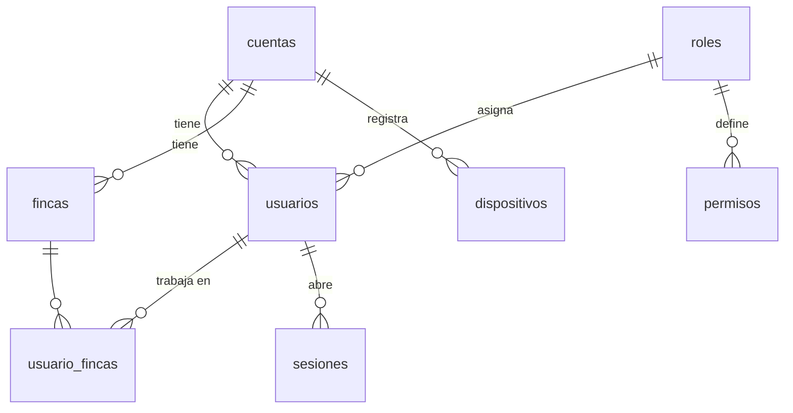
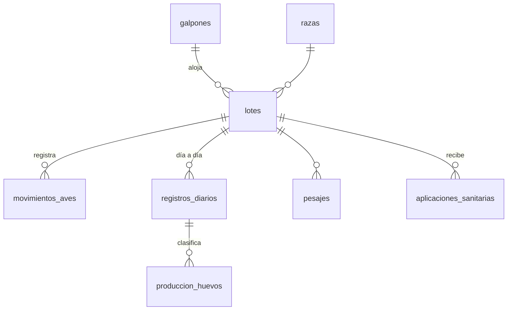
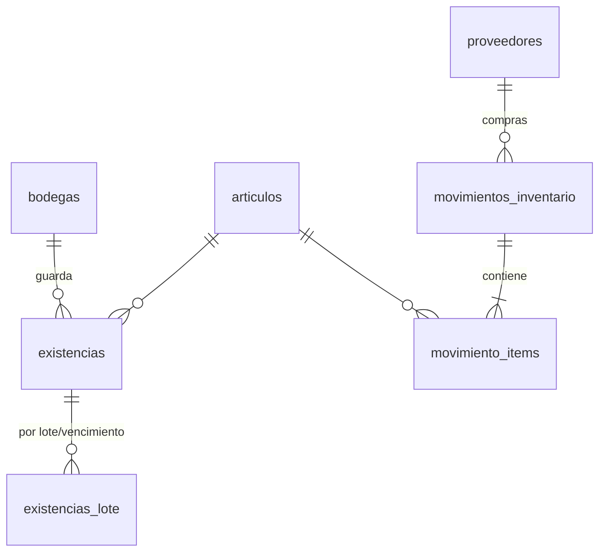
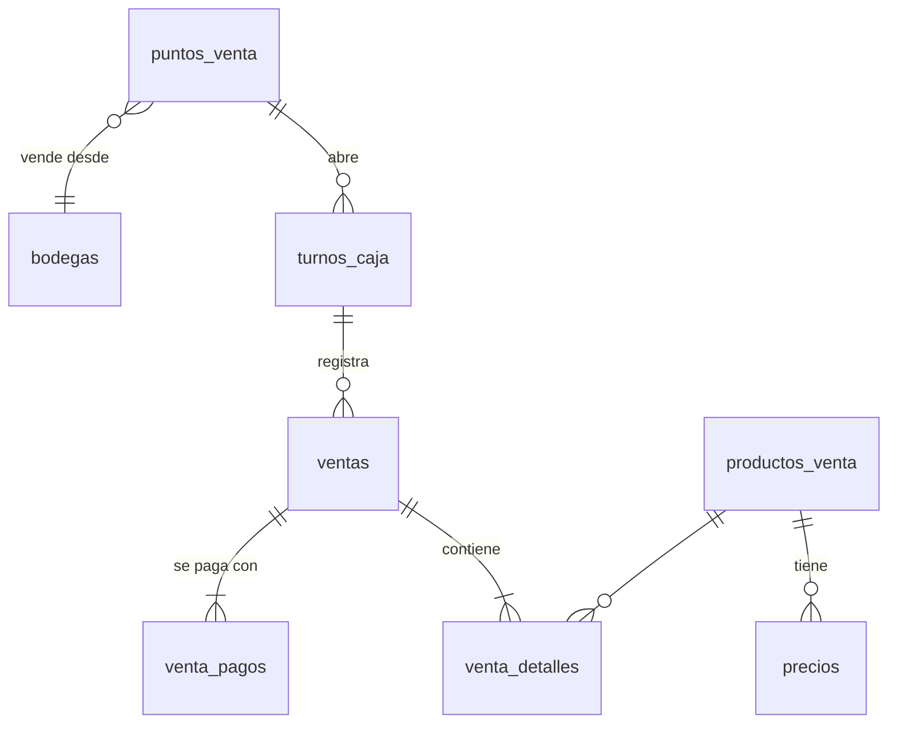

# Avícola v2 — Documento de diseño

> **Estado:** borrador para revisión · **Fecha:** 16/09/2026
> Este documento define **qué** se va a construir y **cómo** se organiza antes de escribir código.
> Revisa especialmente las secciones marcadas con ❓ (decisiones pendientes).

---

## 1. Objetivo

Sistema de gestión para granjas avícolas **multi-cliente**: cada cliente (empresa o persona) administra sus fincas, bodegas, puntos de venta, aves (postura y engorde), inventario, ventas, sanidad y novedades, con **todo lo indispensable auditado**.

### Principios
1. **Aislamiento total entre cuentas.** Una cuenta jamás ve datos de otra. El filtro lo aplica el backend, nunca solo la pantalla.
2. **Todo pertenece a algo.** Cada registro operativo pertenece a una cuenta y, cuando aplica, a una finca, bodega o punto de venta.
3. **Los saldos no se editan a mano.** Las existencias de aves, inventario y caja cambian **solo por movimientos** (con quién, cuándo y por qué).
4. **Nada importante se borra.** Se **anula** con motivo; el registro queda como historial.
5. **Auditoría de solo escritura.** Nadie puede modificar ni borrar el historial desde la aplicación.
6. **Cambios de base de datos por migraciones** (Alembic), nunca editando la base a mano.

---

## 2. Modelo de organización

```
Plataforma Avícola
 └── Cuenta (empresa o persona natural)
      ├── Usuarios (un rol por persona)
      ├── Fincas
      │    ├── Galpones ── Lotes de aves (postura / engorde)
      │    ├── Bodega(s) de la finca          (opcional)
      │    └── Punto(s) de venta de la finca  (opcional)
      ├── Bodega(s) central(es)               (opcional)
      ├── Punto(s) de venta central(es)       (opcional)
      └── Catálogos propios: artículos, precios, métodos de pago, subtipos de novedad, planes sanitarios
```

### Roles

Un usuario tiene **un solo rol**, igual en todas las fincas que tenga asignadas.

| Rol | Alcance | Resumen |
|---|---|---|
| `plataforma` | Toda la plataforma | Crea y suspende cuentas, soporte. No opera granjas. |
| `propietario` | Toda su cuenta | Todo, incluida la gestión de administradores y la configuración de la cuenta. |
| `administrador` | Toda su cuenta | Toda la operación: fincas, bodegas, ventas, precios, usuarios (excepto propietarios). |
| `supervisor` | Fincas asignadas | **Todo** en sus fincas. De las demás fincas de la cuenta solo un **panel resumen** de consulta. |
| `operario` | Fincas asignadas | Registro diario, novedades, consumo, vacunas y **sus** tareas. |
| `cajero` | Puntos de venta asignados | Vender, anular con motivo, cerrar caja, consultar existencias de su bodega. |

### Contexto de trabajo (finca activa)
- **Al iniciar sesión:**
  - Con una sola finca asignada, entra directo.
  - Con varias, elige en cuál trabaja. Se puede cambiar sin cerrar sesión.
  - Un cajero elige su **punto de venta**.
- **Propietario y administrador** tienen un selector con la opción **"Todas las fincas"**. En esa vista solo se consulta; para crear o editar hay que elegir una finca.
- **La finca activa viaja en cada petición** y queda registrada en la auditoría.
- **El backend valida siempre** que el usuario tenga acceso a esa finca.

---

## 3. Modelo de datos

Convenciones:
- Tablas en español y en plural. PK `id`. Fechas en UTC (`DATETIME`); la zona `America/Bogota` se aplica al mostrar.
- Toda tabla operativa lleva `cuenta_id` y, cuando aplica, `finca_id`.
- Todas llevan `creado_en`, `creado_por`, `actualizado_en` y `actualizado_por`.
- Las tablas que se anulan llevan `estado`, `anulado_en`, `anulado_por` y `motivo_anulacion`.

### 3.1 Núcleo y acceso



| Tabla | Campos principales |
|---|---|
| `cuentas` | tipo (`empresa`/`persona`), nombre, documento/NIT, email, teléfono, estado (`activa`/`suspendida`), plan, max_fincas, max_usuarios |
| `roles` | codigo (los 6 de arriba), nombre — **fijos del sistema** |
| `permisos` | rol_id, modulo, ver, crear, editar, anular, exportar, importar |
| `usuarios` | cuenta_id (NULL solo para `plataforma`), rol_id, nombre, documento, email (único), teléfono, pass_hash, estado, debe_cambiar_clave, ultimo_acceso |
| `usuario_fincas` | usuario_id, finca_id |
| `usuario_puntos_venta` | usuario_id, punto_venta_id (cajeros) |
| `sesiones` | usuario_id, refresh_token_hash, finca_activa_id, punto_venta_activo_id, ip, user_agent, expira_en, revocada_en |
| `recuperacion_clave` | usuario_id, codigo_hash, expira_en, intentos, usado_en |
| `fincas` | cuenta_id, nombre, departamento, municipio, dirección, latitud, longitud, área, estado |
| `dispositivos` | cuenta_id, finca_id, nombre, api_key_hash, estado (sensores IoT) |

### 3.2 Infraestructura y sensores

| Tabla | Campos principales |
|---|---|
| `galpones` | finca_id, nombre, uso (`postura`/`engorde`/`mixto`), capacidad, área_m2, estado |
| `tipos_sensor` | cuenta_id (NULL = global), nombre, unidad, rango_min, rango_max |
| `sensores` | galpon_id, tipo_sensor_id, dispositivo_id, nombre, estado |
| `lecturas_sensor` | sensor_id, fecha_hora, valor — índice (sensor_id, fecha_hora) |

### 3.3 Aves: lotes, movimientos, producción y pesajes



| Tabla | Campos principales |
|---|---|
| `razas` | cuenta_id (NULL = global), nombre, propósito (`postura`/`engorde`) |
| `lotes` | finca_id, galpon_id, código, propósito, raza_id, fecha_ingreso, edad_ingreso_dias, cantidad_inicial, **aves_actuales**, **aves_descarte**, peso_inicial_g, costo_aves, estado (`activo`/`en_descarte`/`cerrado`), fecha_cierre |
| `movimientos_aves` | lote_id, fecha, tipo, cantidad, kg, galpon_destino_id, novedad_id, venta_detalle_id, motivo |
| `registros_diarios` | lote_id, fecha (**único por lote y día**), agua_litros, observaciones, usuario_id |
| `produccion_huevos` | registro_diario_id, tipo_huevo_id, cantidad, rotos, sucios |
| `tipos_huevo` | cuenta_id, color, tamaño, articulo_id (su artículo de inventario) |
| `pesajes` | lote_id, fecha, aves_muestreadas, peso_promedio_g, uniformidad_pct |

**Tipos de `movimientos_aves`** (actualizan `aves_actuales` y `aves_descarte` en la misma transacción):

| Tipo | Efecto |
|---|---|
| `ingreso` | + aves_actuales |
| `mortalidad` / `fuga` | − aves_actuales (normalmente desde una novedad) |
| `descarte` | aves_actuales → aves_descarte (gallinas que dejan de producir) |
| `venta_descarte` | − aves_descarte (venta **por unidad**) |
| `venta_engorde` | − aves_actuales, con **kg** (venta **por kilo**) |
| `traslado_salida` / `traslado_entrada` | Entre galpones o fincas |
| `ajuste` | ± con motivo obligatorio (conteo físico) |

> Reemplaza a las tablas actuales `ingreso_gallinas`, `salvamento`, `aislamiento` y a los triggers de ocupación. La ocupación del galpón se calcula como la suma de las aves de sus lotes activos.

**Huevos:** lo registrado en `produccion_huevos` genera automáticamente una **entrada de inventario** del artículo "Huevo AA/AAA/…" (en unidades) en la bodega de la finca.

### 3.4 Bodegas e inventario (kárdex)



| Tabla | Campos principales |
|---|---|
| `bodegas` | cuenta_id, finca_id (NULL = **central**), nombre, estado |
| `categorias_articulo` | código fijo: `alimento`, `vacuna`, `medicamento`, `herramienta`, `repuesto`, `insumo`, `huevo`, `otro` |
| `articulos` | cuenta_id, categoría, código, nombre, unidad (`kg`, `bulto`, `unidad`, `frasco`, `dosis`, `litro`…), stock_minimo, maneja_lote_vencimiento, costo_promedio, datos_extra (JSON: enfermedad, vía de aplicación, laboratorio…), estado |
| `existencias` | bodega_id, articulo_id, cantidad — **solo la modifican los movimientos** |
| `existencias_lote` | bodega_id, articulo_id, lote_fabricante, vencimiento, cantidad |
| `proveedores` | cuenta_id, nombre, NIT, teléfono |
| `movimientos_inventario` | cuenta_id, fecha, tipo, bodega_origen_id, bodega_destino_id, proveedor_id, referencia (tipo + id), importacion_id, motivo, estado |
| `movimiento_items` | movimiento_id, articulo_id, cantidad, costo_unitario, lote_fabricante, vencimiento, lote_aves_id (destino del consumo), galpon_id |
| `prestamos_herramienta` | articulo_id, bodega_id, prestado_a, fecha_salida, fecha_devolucion (opcional) |

**Tipos de movimiento:** `compra` · `entrada_produccion` · `consumo` (a un lote o galpón) · `aplicacion_sanitaria` · `traslado` · `venta` · `ajuste` (motivo obligatorio) · `baja` (daño o vencimiento).

**Costeo:** costo promedio ponderado por artículo. Con él se valoran el consumo de alimento y las vacunas en el **balance del lote**.

### 3.5 Sanidad

| Tabla | Campos principales |
|---|---|
| `aplicaciones_sanitarias` | finca_id, lote_id **o** galpon_id, fecha, tipo (`vacuna`/`medicamento`/`tratamiento`), articulo_id, lote_fabricante, dosis, aves_tratadas, vía, responsable_id, observaciones, movimiento_inventario_id |
| `planes_sanitarios` | cuenta_id, nombre, propósito |
| `plan_sanitario_items` | plan_id, dia_edad, articulo_id, vía, obligatorio |
| `recordatorios_sanitarios` | lote_id, plan_item_id, fecha_programada, aplicacion_id (cuando se cumple), estado |

> Mínimo exigido para importar desde Excel: **fecha, lote o galpón, vacuna**.

### 3.6 Ventas y caja



| Tabla | Campos principales |
|---|---|
| `puntos_venta` | cuenta_id, finca_id (NULL = central), bodega_id, nombre, prefijo, siguiente_consecutivo, estado |
| `metodos_pago` | cuenta_id, nombre (`Efectivo`, `Transferencia`…), es_efectivo, estado |
| `productos_venta` | cuenta_id, nombre, tipo (`huevo`/`ave_descarte`/`ave_engorde`/`articulo`), articulo_id, **factor** (1, 12, 15, 30), **cobro_por** (`unidad`/`kg`), estado |
| `precios` | producto_id, punto_venta_id (NULL = precio general), precio, vigente_desde, creado_por — **historial** |
| `turnos_caja` | punto_venta_id, cajero_id, abierto_en, base_inicial, cerrado_en, efectivo_contado, total_sistema_efectivo, diferencia, observaciones |
| `ventas` | cuenta_id, punto_venta_id, turno_id, número (consecutivo por punto), fecha_hora, cajero_id, subtotal, descuento, total, estado (`activa`/`anulada`), anulada_por, anulada_en, motivo_anulacion |
| `venta_detalles` | venta_id, producto_id, cantidad, factor, unidades_descontadas, kg, lote_aves_id, precio_unitario, descuento, subtotal |
| `venta_pagos` | venta_id, metodo_pago_id, valor (permite pago mixto) |

**Productos iniciales por tipo de huevo:**

| Producto | Factor | Cobro |
|---|---|---|
| Huevo AA — unidad | 1 | unidad |
| Huevo AA — docena | 12 | unidad |
| Huevo AA — medio panal | 15 | unidad |
| Huevo AA — panal | 30 | unidad |
| Gallina de descarte | 1 | unidad (desde `aves_descarte` del lote) |
| Ave de engorde | 1 | **kg** (cantidad de aves + kg pesados) |

**Reglas:**
- **Precio:** lo toma el sistema. El cajero no lo digita; el descuento solo se aplica si el rol lo permite.
- **Total:** se **guarda** en la venta (con precios fijos, el valor cobrado no debe cambiar después).
- **Al vender** se crean, en la misma transacción, el movimiento de inventario (huevos) o el movimiento de aves, y la validación impide vender más de lo disponible.
- **Anular:**
  - Exige motivo, devuelve existencias y conserva todo.
  - El cajero **puede anular** y queda auditado. Se puede limitar a ventas de su turno abierto.
- **Cierre de caja:** total del sistema por método de pago frente al efectivo contado, con su diferencia. Un turno cerrado ya no admite ventas.

### 3.7 Novedades (bitácora) y tareas

| Tabla | Campos principales |
|---|---|
| `novedad_categorias` | fijas: `sanidad`, `infraestructura`, `clima`, `servicios`, `seguridad`, `equipos`, `otro` |
| `novedad_subtipos` | cuenta_id (NULL = global), categoría, nombre, **afecta_aves** (`mortalidad`/`fuga`/NULL) — **editable por el administrador** |
| `novedades` | finca_id, galpon_id, lote_id, subtipo_id, gravedad (`baja`/`media`/`alta`/`critica`), fecha_hora, descripción, aves_afectadas, estado (`abierta`/`en_atencion`/`resuelta`/`anulada`), responsable_id, costo_estimado, costo_real, solución, reportado_por, resuelto_por, resuelto_en |
| `tareas` | finca_id, galpon_id, título, descripción, asignado_a, prioridad, fecha_limite, estado, novedad_id, rutina_id, completada_en |
| `rutinas` | finca_id, galpon_id, título, frecuencia (`diaria`/`semanal`), días, asignado_a o rol, activa → genera tareas cada día |
| `adjuntos` | cuenta_id, entidad, entidad_id, ruta_archivo, tipo, tamaño, subido_por (fotos de novedades y comprobantes) |

- Si el subtipo de la novedad `afecta_aves`, se crea el movimiento de aves correspondiente.
- Desde una novedad se puede crear una tarea; al completarla se ofrece cerrar la novedad.

### 3.8 Dinero

| Tabla | Campos principales |
|---|---|
| `categorias_gasto` | cuenta_id, nombre (mano de obra, servicios, mantenimiento, transporte…) |
| `gastos` | finca_id, lote_id (opcional), categoría_id, fecha, valor, descripción, proveedor_id, adjunto |

**Balance de un lote** (calculado, no almacenado):
- **Ingresos:** ventas del lote (huevos atribuidos por producción, descarte y engorde).
- **Costos:** costo de las aves + consumo de alimento valorizado + aplicaciones sanitarias valorizadas + gastos asignados.
- **Indicadores:**
  - Utilidad y costo por huevo o por kg.
  - Conversión alimenticia.
  - Porcentaje de postura y porcentaje de mortalidad.
  - Ganancia diaria de peso (engorde).

### 3.9 Auditoría, alertas e importación

| Tabla | Campos principales |
|---|---|
| `auditoria` | cuenta_id, usuario_id, finca_id, fecha_hora, acción (`crear`/`editar`/`anular`/`eliminar`/`login`/`login_fallido`/`importar`/`exportar`/`cambio_precio`/`cierre_caja`…), entidad, entidad_id, antes (JSON), después (JSON), motivo, ip, user_agent |
| `alertas` | cuenta_id, finca_id, tipo (`stock_minimo`/`vencimiento`/`sensor`/`vacuna_pendiente`/`mortalidad_alta`), severidad, mensaje, entidad, entidad_id, creada_en, atendida_por, atendida_en |
| `importaciones` | cuenta_id, finca_id, tipo, nombre_archivo, usuario_id, estado, filas_total, filas_ok, filas_error, errores (JSON), revertida_en |
| `plantillas_importacion` | cuenta_id, tipo, nombre, mapeo_columnas (JSON) |

- **`auditoria` es de solo escritura:** el usuario de la base de datos de la aplicación no tendrá permiso de `UPDATE` ni `DELETE` sobre ella, y además un trigger lo bloquea.
- **Registros importados:** todo lo que se importa lleva `importacion_id`, así que una importación se puede **revertir completa** (se anulan sus movimientos).

---

## 4. Backend

### 4.1 Tecnología
- **FastAPI + MySQL 8** (se mantiene).
- **SQLAlchemy 2.0 con modelos ORM** en lugar de SQL escrito a mano. Hace falta para aplicar el filtro por cuenta y finca en un solo lugar, para Alembic y para reducir el código repetido.
- **Alembic** para migraciones.
- **Redis** para el límite de intentos y la revocación de sesiones (servicio más en docker-compose).
- **Almacenamiento de archivos:** carpeta local montada como volumen en v2; más adelante, Azure Blob Storage.

### 4.2 Estructura
```
backend/
├── app/
│   ├── main.py
│   ├── core/            # config, db, seguridad, contexto (cuenta/finca), auditoría, errores
│   ├── modelos/         # ORM por módulo
│   ├── esquemas/        # Pydantic por módulo
│   ├── servicios/       # reglas de negocio (ventas, inventario, aves…) — transacciones aquí
│   ├── rutas/           # endpoints delgados: validan permiso, llaman al servicio
│   └── importacion/     # lectores Excel/CSV, mapeo, validadores por tipo
├── migraciones/         # Alembic
├── scripts/             # crear cuenta/usuario plataforma, datos demo
└── tests/
```

### 4.3 Seguridad y contexto
- **Tokens de acceso** de corta duración (15 min) y **refresh token** en cookie `HttpOnly` con rotación.
- **Cerrar sesión** revoca el refresh token.
- **Dependencia única `contexto`**, que resuelve para cada petición el usuario, la cuenta, las fincas permitidas, la finca activa (cabecera `X-Finca-Id`) y el punto de venta activo.
- **Dependencia `requiere("ventas", "anular")`** reemplaza los ~170 bloques repetidos de verificación de permisos.
- **Repositorio base** que agrega siempre `cuenta_id` y el filtro de fincas a las consultas.
- **Pruebas automáticas de aislamiento:** un usuario de la cuenta A nunca obtiene datos de la cuenta B (prueba obligatoria en cada módulo).
- **Dispositivos IoT:** se autentican con `X-Api-Key` y solo pueden enviar lecturas.

### 4.4 Convenciones de la API
- Prefijo `/api/v1`, recursos en español y en plural: `/fincas`, `/galpones`, `/lotes`, `/lotes/{id}/movimientos`, `/bodegas`, `/articulos`, `/movimientos-inventario`, `/ventas`, `/ventas/{id}/anular`, `/turnos-caja`, `/novedades`, `/tareas`, `/importaciones`…
- **Paginación estándar:** `?pagina=1&por_pagina=25` → `{ items, total, pagina, paginas }`.
- **Filtros comunes:** `desde`, `hasta`, `finca_id`, `estado`, `buscar`.
- **Errores uniformes:** `{ "detalle": "...", "codigo": "STOCK_INSUFICIENTE", "campos": {...} }`.
- **Permisos:** 401 = sin sesión, 403 = sin permiso, 404 = no existe o no pertenece a la cuenta, 409 = conflicto (duplicado, stock).
- **Anulaciones:** `POST /…/{id}/anular` con `{ "motivo": "..." }`, nunca `DELETE`.

---

## 5. Frontend

### 5.1 ❓ Tecnología (decisión pendiente)

| Opción | A favor | En contra |
|---|---|---|
| **A. Mantener HTML + JS + Bootstrap** | Se reaprovechan estilos y algo de código; no hay que aprender nada nuevo | Con v2 cambian casi todas las pantallas; sin componentes ni tipos, el código repetido vuelve a crecer |
| **B. Next.js + TypeScript + Tailwind** (recomendada) | Ya lo manejas; componentes reutilizables (tablas, formularios, selector de finca); tipos compartidos con la API; más fácil hacerla PWA | Es reescribir el frontend (igual cambia casi todo) |

### 5.2 Pantallas

- **Acceso:** iniciar sesión · elegir finca o punto de venta · recuperar contraseña · cambiar contraseña · mi perfil.
- **Panel:**
  - Por finca: aves vivas, % postura del día, huevos, mortalidad 7 días, alertas, tareas de hoy, novedades abiertas.
  - Consolidado (propietario/administrador): comparativo entre fincas.
  - **Resumen de otras fincas** (supervisor, solo lectura).
- **Operación diaria (móvil primero):** **Cierre del día** por galpón (huevos por tipo, rotos, muertes, alimento, agua, novedad rápida) · Mis tareas · Reportar novedad (con foto).
- **Aves:** Lotes (lista, ficha con indicadores y curva) · Movimientos · Pesajes · Descarte · Traslados.
- **Sanidad:** Aplicaciones · Calendario y recordatorios · Planes sanitarios.
- **Inventario:** Existencias por bodega · Kárdex por artículo · Compras · Consumos · Traslados · Ajustes y bajas · Artículos · Proveedores · Préstamos de herramientas · Vencimientos.
- **Ventas (cajero):** **Venta rápida** (botones por producto; engorde pide aves y kg) · Ventas del turno · Anular · Abrir y cerrar caja · Comprobante imprimible.
- **Ventas (administración):** Historial y filtros · Puntos de venta · Productos y precios (con historial) · Métodos de pago · Cierres de caja.
- **Novedades y tareas:** Bitácora · Tareas · Rutinas.
- **Dinero:** Gastos · Balance por lote · Balance por finca/mes.
- **Reportes:** producción, mortalidad, conversión, ventas, caja, inventario valorizado, novedades y costo de daños. Todos exportables a CSV, Excel y PDF.
- **Importar:** asistente de 4 pasos (subir → relacionar columnas → validar → confirmar) · historial de importaciones (con opción de revertir) · plantillas descargables.
- **Configuración:** Cuenta · Fincas · Galpones · Bodegas · Usuarios y asignaciones · Subtipos de novedad · Tipos de huevo · Razas · Categorías de gasto · Sensores y dispositivos.
- **Auditoría:** consulta con filtros (usuario, fecha, entidad, acción) y detalle antes/después.
- **Plataforma (solo tú):** cuentas, estado y límites.

---

## 6. Importación desde Excel

| Tipo | Columnas mínimas | Opcionales |
|---|---|---|
| Compras / entradas de inventario | fecha, artículo, cantidad | unidad, costo, proveedor, lote fabricante, vencimiento, bodega |
| Consumo de alimento | fecha, galpón o lote, artículo, cantidad | bodega |
| Vacunas y tratamientos | fecha, lote o galpón, vacuna/medicamento | dosis, aves, vía, lote fabricante, responsable, observaciones |
| Artículos (catálogo) | nombre, categoría, unidad | código, stock mínimo |
| Existencias iniciales | artículo, bodega, cantidad | costo, lote, vencimiento |
| Lotes / ingresos de aves | fecha, galpón, cantidad, propósito | raza, edad, peso, costo |
| Producción diaria | fecha, lote o galpón, huevos | tipo, rotos, sucios |
| Mortalidad | fecha, lote o galpón, cantidad | causa |
| Pesajes | fecha, lote, peso promedio | aves muestreadas |
| Gastos | fecha, categoría, valor | finca, lote, descripción, proveedor |

**Cómo funciona:**
- **Relación de columnas:** se detecta por sinónimos ("cant", "cantidad", "kg", "bultos"…) y el usuario la corrige.
- **Artículos y galpones:** se buscan por nombre sin importar tildes ni mayúsculas. Si no existen, se ofrece **crearlos** o saltar la fila.
- **Fechas:** se aceptan `dd/mm/aaaa`, `aaaa-mm-dd` y fechas de Excel.
- **Duplicados:** se detectan por fecha, artículo o lote y cantidad.
- **Transacción única:** todo se guarda junto o no se guarda nada.

---

## 7. Plan de trabajo

| Fase | Entregables | Listo cuando… |
|---|---|---|
| **A – Base** | Repo nuevo, docker-compose (MySQL, Redis, API, web) · modelos ORM + Alembic · cuentas, usuarios, roles, permisos, fincas, asignaciones · login con refresh token, finca activa, cambiar y recuperar contraseña · auditoría · contexto y filtro por cuenta · galpones · pantalla de configuración básica · CI con pruebas | Dos cuentas de prueba totalmente aisladas; cada rol ve solo lo suyo; toda acción queda en auditoría |
| **B – Inventario** | Bodegas, artículos, existencias, kárdex, compras, consumos, traslados, ajustes, vencimientos, alertas de mínimo | Existencias cuadran con el kárdex; traslados central ↔ finca |
| **C – Ventas** | Puntos de venta, productos y precios, venta rápida, pagos mixtos, anulación con motivo, turnos y cierre de caja, comprobante | Venta de docena/panal descuenta unidades; engorde por kg; cierre de caja cuadra |
| **D – Granja** | Lotes (postura y engorde), movimientos de aves, cierre del día, producción → inventario, pesajes, sanidad y recordatorios, novedades, tareas y rutinas, gastos, balances e indicadores, panel | Balance de un lote de engorde completo de principio a fin |
| **E – Importación** | Asistente, plantillas, validación, historial y reversión | Importar un Excel desordenado de vacunas y de alimento sin errores |
| **F – Comodidad** | PWA instalable, registro sin conexión del cierre del día, fotos, sensores por API key | El operario registra sin señal y se sincroniza después |
| **Final – Azure** | VM, HTTPS, copias de seguridad, monitoreo, correo transaccional | — |

> El código actual (v1) queda como referencia. Se reaprovecha la lógica ya probada (ventas atómicas, validaciones, reglas de ocupación, exportación y límites de intentos).

---

## 8. ❓ Decisiones pendientes

1. **Frontend:** ¿opción A (HTML + JS) u opción B (Next.js + TypeScript)?
2. **Nombre y ubicación del repo nuevo:** ¿`avicola` con carpetas `backend/` y `frontend/` en un solo repo? (recomendado)
3. **Descuentos en ventas:** ¿el cajero puede aplicarlos? ¿Con un tope (por ejemplo, 10 %)?
4. **Anulación por cajero:** ¿cualquier venta o solo las de su turno abierto?
5. **Numeración de ventas:** ¿consecutivo por punto de venta (`PV1-000123`) está bien?
6. **Unidades del alimento:** ¿lo manejan en kg, en bultos o en ambos? (si es ambos, se define la conversión por artículo)
7. **Datos demo:** ¿quieres un script que cree una cuenta de ejemplo con 2 fincas, bodegas, lotes y ventas para probar?
