# Manual de usuario de Avícola

**Sistema de gestión para granjas avícolas**

Este manual explica, paso a paso, cómo usar Avícola en el día a día de una granja: desde entrar por
primera vez hasta cerrar la caja, registrar la recolección de huevos, controlar el inventario o
revisar los reportes del mes.

Las imágenes muestran la cuenta de ejemplo **Granja Avícola La Esperanza**, que se puede cargar con
los datos de prueba (ver el [README](../../README.md#datos-de-ejemplo)).

---

## Contenido

1. [Qué es Avícola](#1-qué-es-avícola)
2. [Conceptos básicos](#2-conceptos-básicos)
3. [Roles: qué puede hacer cada persona](#3-roles-qué-puede-hacer-cada-persona)
4. [Entrar al sistema](#4-entrar-al-sistema)
5. [Conocer la pantalla](#5-conocer-la-pantalla)
6. [Panel de inicio](#6-panel-de-inicio)
7. [Avisos (la campana)](#7-avisos-la-campana)
8. [Primeros pasos: dejar lista la granja](#8-primeros-pasos-dejar-lista-la-granja)
9. [Aves](#9-aves)
   - [Lotes](#91-lotes)
   - [Detalle del lote](#92-detalle-del-lote)
   - [Producción de huevos](#93-producción-de-huevos)
   - [Vacunas y tratamientos](#94-vacunas-y-tratamientos)
   - [Sensores](#95-sensores)
10. [Operación](#10-operación)
    - [Tareas y rutinas](#101-tareas-y-rutinas)
    - [Novedades](#102-novedades)
    - [Reportes](#103-reportes)
11. [Inventario](#11-inventario)
    - [Bodegas](#111-bodegas)
    - [Artículos](#112-artículos)
    - [Entradas y salidas](#113-entradas-y-salidas)
    - [Proveedores](#114-proveedores)
12. [Ventas](#12-ventas)
    - [Puntos de venta](#121-puntos-de-venta)
    - [Productos y precios](#122-productos-y-precios)
    - [Caja](#123-caja)
13. [Organización](#13-organización)
    - [Fincas](#131-fincas)
    - [Galpones](#132-galpones)
    - [Usuarios](#133-usuarios)
    - [Roles y permisos](#134-roles-y-permisos)
    - [Cuentas (plataforma)](#135-cuentas-solo-plataforma)
14. [Sistema](#14-sistema)
    - [Importar desde Excel](#141-importar-desde-excel)
    - [Registro de cambios](#142-registro-de-cambios)
    - [Mi cuenta](#143-mi-cuenta)
15. [Usar Avícola desde el celular](#15-usar-avícola-desde-el-celular)
16. [El día a día según el rol](#16-el-día-a-día-según-el-rol)
17. [Reglas que el sistema cuida por ti](#17-reglas-que-el-sistema-cuida-por-ti)
18. [Preguntas frecuentes y problemas comunes](#18-preguntas-frecuentes-y-problemas-comunes)
19. [Glosario](#19-glosario)

---

## 1. Qué es Avícola

Avícola reúne en un solo lugar todo lo que pasa en una granja avícola:

| Área | Qué se lleva |
|---|---|
| **Aves** | Lotes, mortalidad, descarte, ventas de aves, traslados, pesajes, alimento entregado, vacunas y tratamientos |
| **Producción** | Recolección diaria de huevos por tipo (Super, AAA, AA, A, B, sucios y rotos) y huevos disponibles para vender |
| **Sensores** | Temperatura, humedad, amoníaco, CO₂, luz, agua y peso del silo, con alerta cuando algo se sale de lo normal |
| **Inventario** | Bodegas, artículos, compras, consumos, traslados, conteos y costo promedio |
| **Ventas** | Puntos de venta, productos y precios, caja con apertura y cierre, formas de pago y descuentos |
| **Operación** | Tareas del día, rutinas que se repiten, novedades (daños, clima, plagas, robos) y reportes |
| **Organización** | Varias fincas, galpones, usuarios, roles y permisos |

Funciona en el computador y en el celular, y se puede instalar como una aplicación.

---

## 2. Conceptos básicos

| Término | Qué es |
|---|---|
| **Cuenta** | La empresa o persona dueña de la granja. Todo lo que se registra pertenece a una cuenta y nadie de otra cuenta lo puede ver. |
| **Finca** | Cada predio de la cuenta. Una cuenta puede tener varias fincas y la información se lleva separada por finca. |
| **Finca activa** | La finca en la que estás trabajando en este momento. Se elige al entrar y se puede cambiar arriba. |
| **Galpón** | Cada construcción donde viven las aves. Tiene tipo (postura, levante, engorde o cría) y capacidad. |
| **Lote** | Un grupo de aves que entró junto a un galpón: raza, fecha, edad, cuántas entraron y cuánto costó cada una. |
| **Descarte** | Gallinas que dejaron de producir. Salen del conteo de producción y quedan listas para vender como salvamento. |
| **Bodega** | Lugar donde se guardan artículos. La **bodega central** sirve a toda la cuenta; las demás pertenecen a una finca. |
| **Artículo** | Cualquier cosa que se guarda en bodega: alimento, vacunas, medicamentos, herramientas, repuestos, insumos. |
| **Punto de venta** | Lugar donde se vende (la tienda de la finca, un punto en el pueblo). Cada uno numera sus ventas. |
| **Turno de caja** | El tiempo entre abrir y cerrar la caja. Cada venta queda dentro de un turno. |
| **Rutina** | Una tarea que se repite (todos los días, algunos días de la semana o una vez al mes). |
| **Novedad** | Algo que se sale de lo normal: un daño, un corte de luz, una plaga, un robo, un problema de salud del lote. |
| **Anular** | Deshacer un registro sin borrarlo. Lo anulado sigue a la vista, con el motivo, quién lo anuló y cuándo. |

---

## 3. Roles: qué puede hacer cada persona

Cada usuario tiene un rol. El rol define qué pantallas ve y qué puede hacer en ellas. Los permisos que
trae el sistema son estos (el propietario los puede cambiar en **Roles y permisos**):

| Rol | Para quién es | Qué puede hacer |
|---|---|---|
| **Propietario** | El dueño de la cuenta | Todo dentro de su cuenta, en todas sus fincas. |
| **Administrador** | Quien maneja la operación | Toda la operación de todas las fincas. Puede ver y ajustar los permisos de los roles y consultar el registro de cambios. |
| **Supervisor** | El encargado de una o varias fincas | Lotes, producción, vacunas, alimento, pesajes, inventario, tareas, novedades y sensores de sus fincas. Consulta usuarios, bodegas, proveedores, productos y reportes. Puede tener otras fincas en modo *solo consulta*. |
| **Operario** | Quien hace el trabajo diario | Registra recolección de huevos, mortalidad, alimento, pesajes, vacunas, salidas de bodega y novedades. Ve y marca **sus** tareas. Consulta lotes, galpones, bodegas y sensores. |
| **Cajero** | Quien atiende el punto de venta | Abre y cierra la caja, vende y anula ventas **de su propio turno**. Reporta novedades y ve sus tareas. |
| **Plataforma** | El administrador del sistema | Crea y administra las cuentas de todas las granjas. |

> **Descuentos:** el cajero, el operario y el supervisor pueden dar descuento hasta el tope que tenga
> la cuenta (10 % de fábrica). El administrador y el propietario no tienen tope. El tope se cambia en
> **Ventas → Puntos de venta → Descuentos**.

---

## 4. Entrar al sistema

### 4.1 Iniciar sesión

1. Abre la dirección de Avícola en el navegador (en una instalación local es `http://localhost:3000`).
2. Escribe tu **correo** y tu **contraseña**.
3. Pulsa **Entrar**.

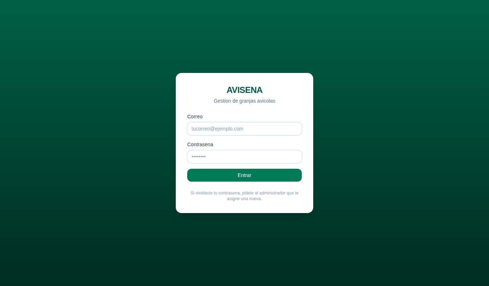

Si escribes mal la contraseña varias veces seguidas, el sistema bloquea los intentos por unos minutos
para proteger la cuenta.

### 4.2 Cambiar la contraseña la primera vez

Cuando el administrador te crea el usuario, te da una contraseña temporal. Al entrar por primera vez
el sistema te pide cambiarla antes de seguir. La nueva contraseña debe tener **al menos 8 caracteres**.

### 4.3 Elegir la finca

Si trabajas en más de una finca, al entrar eliges en cuál vas a trabajar. Si solo tienes una, entras
directo.

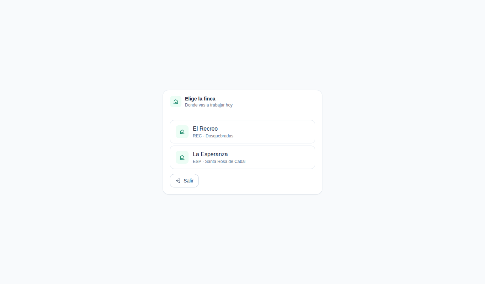

Las fincas marcadas **Solo consulta** te dejan ver la información pero no registrar nada.

### 4.4 Si olvidaste la contraseña

Pídele al administrador de tu granja que te asigne una nueva en **Usuarios → Contraseña**. Al entrar
con ella, el sistema te pedirá cambiarla.

### 4.5 Salir

Toca tu nombre arriba a la derecha y elige **Cerrar sesión**. Si dejas de usar el sistema un buen rato,
te pedirá entrar otra vez.

---

## 5. Conocer la pantalla

### 5.1 El menú

El menú está oculto para dejar todo el espacio a la información. Ábrelo con el botón de las **tres
rayas** (☰) arriba a la izquierda.

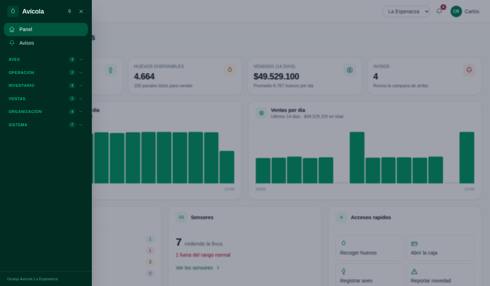

- **Panel** y **Avisos** están siempre a la vista.
- Los demás módulos están agrupados: **Aves**, **Operación**, **Inventario**, **Ventas**,
  **Organización** y **Sistema**. Toca el nombre del grupo para desplegarlo o recogerlo. El número al
  lado dice cuántas opciones tiene.
- El grupo de la pantalla en la que estás se abre solo y la opción actual queda resaltada.
- El menú recuerda qué grupos dejaste abiertos y hasta dónde bajaste.
- Se cierra solo al elegir una opción, al tocar afuera o con la tecla **Esc**.
- En computador, el botón del **pin** (📌) deja el menú **fijo** al lado. Para volver a ocultarlo usa
  la flecha **‹**.

Solo ves las opciones que tu rol puede usar.

### 5.2 La barra de arriba

De izquierda a derecha:

- **☰** abre el menú.
- **Nombre de la finca activa** y tu rol.
- **Selector de finca** (si trabajas en varias): cambia la finca activa sin salir.
- **Campana**: los avisos (ver [capítulo 7](#7-avisos-la-campana)).
- **Tu nombre**: abre el menú de usuario con **Mi cuenta**, **Avisos** y **Cerrar sesión**.

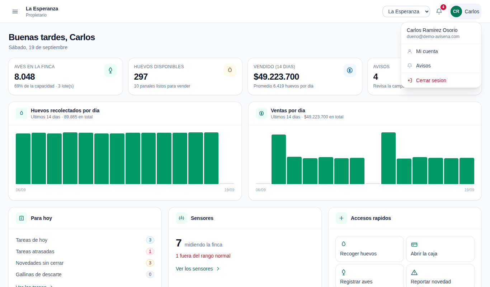

### 5.3 Ventanas, confirmaciones y mensajes

- Los formularios se abren en una **ventana** encima de la pantalla. Se cierra con la **X**, dando
  **clic afuera** de la ventana o con **Esc**.
- Antes de algo importante (anular, desactivar, deshacer) el sistema pide **confirmación** y, cuando
  corresponde, el **motivo**.
- Los resultados salen como **mensajes cortos** en la esquina superior derecha: verdes cuando todo salió
  bien, rojos cuando algo falló. Desaparecen solos.

### 5.4 Listas largas

Las listas con muchos registros se muestran por **páginas**. Abajo de cada lista verás cuántos
registros hay en total y los números de página para moverte.

---

## 6. Panel de inicio

Es lo primero que ves al entrar. Resume cómo va la finca activa.

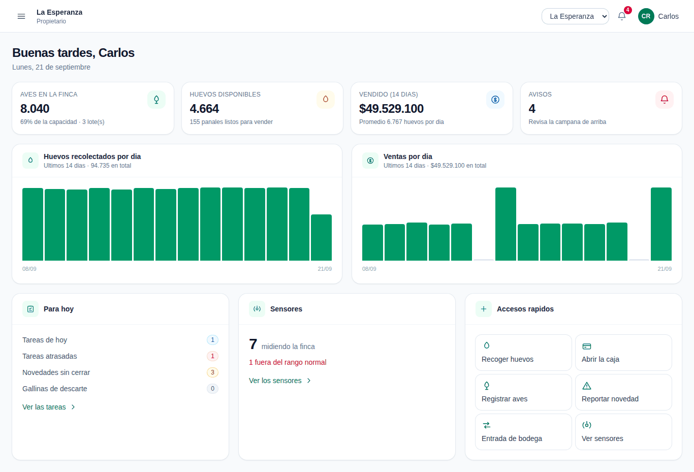

| Parte | Qué muestra |
|---|---|
| **Aves en la finca** | Aves vivas, porcentaje de ocupación de los galpones y lotes activos |
| **Huevos disponibles** | Huevos listos para vender y cuántos panales son |
| **Vendido (14 días)** | Total vendido y promedio de huevos recolectados por día |
| **Avisos** | Cuántos avisos hay pendientes |
| **Huevos recolectados por día** | Gráfica de los últimos 14 días. Pasa el mouse sobre una barra para ver el número exacto |
| **Ventas por día** | Gráfica de lo vendido en los últimos 14 días |
| **Para hoy** | Tareas de hoy, tareas atrasadas, novedades sin cerrar y gallinas de descarte |
| **Sensores** | Cuántos sensores están midiendo y cuántos están fuera de rango |
| **Accesos rápidos** | Botones directos a lo más usado: recoger huevos, abrir la caja, registrar aves, reportar novedad, entrada de bodega y ver sensores |

---

## 7. Avisos (la campana)

La campana de arriba muestra lo que necesita atención. El número rojo indica que hay algo **crítico**;
el ámbar, que hay avisos normales.

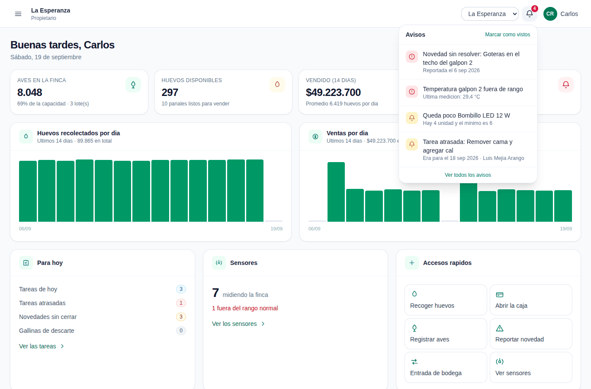

El sistema avisa de:

| Aviso | Cuándo aparece | Nivel |
|---|---|---|
| **Queda poco (artículo)** | Un artículo está por debajo de su mínimo | Crítico si ya no queda nada |
| **Sensor fuera de rango** | La última medición de un sensor se salió de su rango normal | Crítico |
| **Refuerzo próximo / atrasado** | Una vacuna o tratamiento tiene refuerzo en los próximos 7 días, o ya se pasó la fecha | Crítico si está atrasado |
| **Tarea atrasada** | Una tarea de días anteriores sigue pendiente | Aviso |
| **Novedad sin resolver** | Una novedad de gravedad alta sigue abierta | Crítico |
| **Caja sin cerrar** | Quedó abierta una caja de un día anterior | Aviso |

- Toca un aviso para ir a la pantalla donde se arregla.
- **Marcar como vistos** apaga el número de la campana, pero los avisos siguen en la lista mientras el
  problema exista.
- **Los avisos se cierran solos** cuando el problema se resuelve: al comprar el artículo, al registrar
  el refuerzo, al marcar la tarea como hecha, al cerrar la novedad o la caja.
- La pantalla **Avisos** muestra todos, con filtros por nivel.

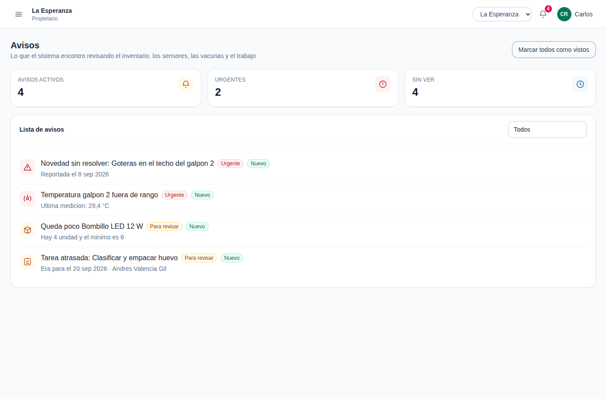

---

## 8. Primeros pasos: dejar lista la granja

Cuando se empieza a usar Avícola, el propietario o el administrador configura la granja en este
orden. Cada paso se explica en detalle más adelante.

| Paso | Dónde | Qué hacer |
|---|---|---|
| 1 | **Organización → Fincas** | Crear cada finca con su código, municipio y teléfono |
| 2 | **Organización → Galpones** | Crear los galpones de cada finca con su tipo y capacidad |
| 3 | **Inventario → Bodegas** | Revisar la bodega central y crear la bodega de cada finca |
| 4 | **Inventario → Proveedores** | Registrar a quién se le compra |
| 5 | **Inventario → Artículos** | Crear el alimento, las vacunas, los medicamentos y los insumos con su mínimo |
| 6 | **Inventario → Entradas y salidas** | Registrar lo que hay hoy en bodega (una entrada inicial) |
| 7 | **Aves → Lotes** | Ingresar los lotes que ya están en los galpones con su edad actual |
| 8 | **Ventas → Puntos de venta** | Crear los puntos donde se vende |
| 9 | **Ventas → Productos y precios** | Crear cómo se vende cada cosa y su precio |
| 10 | **Aves → Sensores** | Registrar los equipos de medición de cada galpón |
| 11 | **Operación → Tareas → Nueva rutina** | Crear las labores que se repiten |
| 12 | **Organización → Usuarios** | Crear a cada trabajador con su rol y sus fincas |

> **Atajo:** si ya tienes esta información en Excel (artículos, proveedores, compras, vacunas o
> producción), puedes subirla desde **Sistema → Importar desde Excel**.

---

## 9. Aves

### 9.1 Lotes

**Menú: Aves → Lotes**

Muestra los lotes de la finca activa con su galpón, propósito, edad (en semanas y días), aves vivas,
aves de descarte y mortalidad acumulada. La casilla **Solo activos** oculta los lotes cerrados.

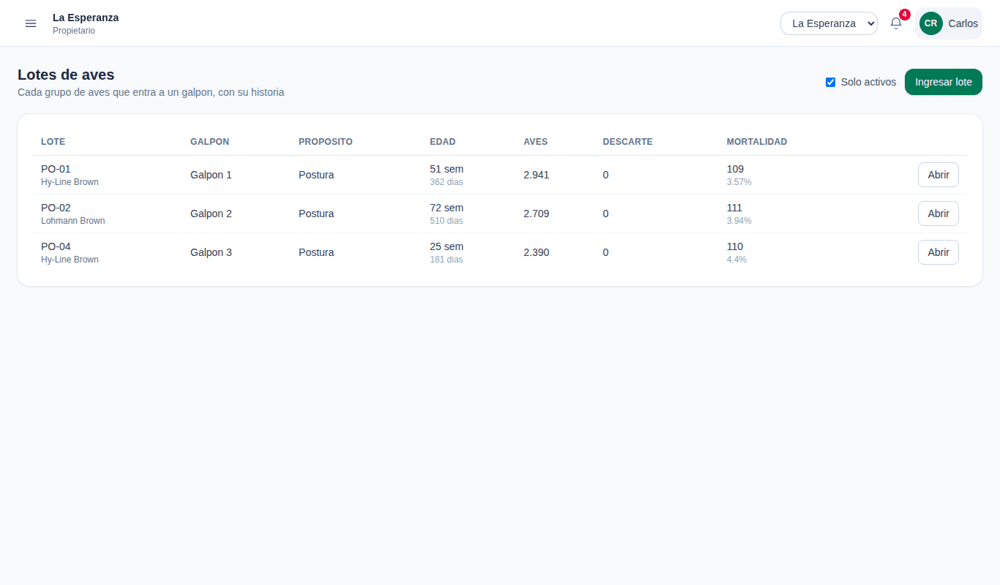

#### Ingresar un lote

1. Pulsa **Ingresar lote**.
2. Llena el formulario:

   | Campo | Qué poner |
   |---|---|
   | **Código del lote** | Un nombre corto y único en la finca, por ejemplo `PO-05` |
   | **Galpón** | Dónde van a vivir las aves |
   | **Propósito** | Postura (huevos), engorde (carne) o levante (pollitas que luego pasan a postura) |
   | **Raza** | Hy-Line Brown, Lohmann Brown, Isa Brown, Ross 308, Cobb 500, etc. |
   | **Fecha de ingreso** | El día que llegaron |
   | **Edad al ingresar (días)** | 1 si son pollitos de un día; la edad real si llegan más grandes o si ya estaban en la finca |
   | **Cuántas aves entran** | El número exacto |
   | **Costo por ave** | Lo que costó cada una (sirve para calcular el costo del lote) |
   | **Observaciones** | Cualquier nota útil |

3. Pulsa **Guardar**.

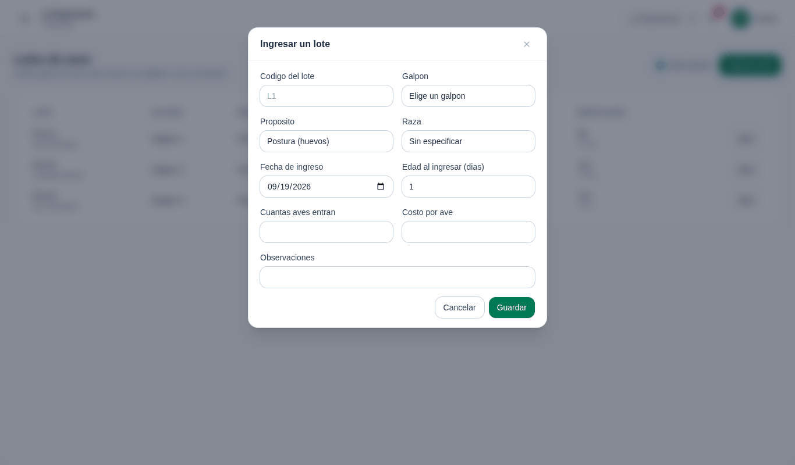

El sistema no deja pasar de la capacidad del galpón y actualiza su ocupación automáticamente.

### 9.2 Detalle del lote

Toca **Abrir** en un lote para ver todo su historial.

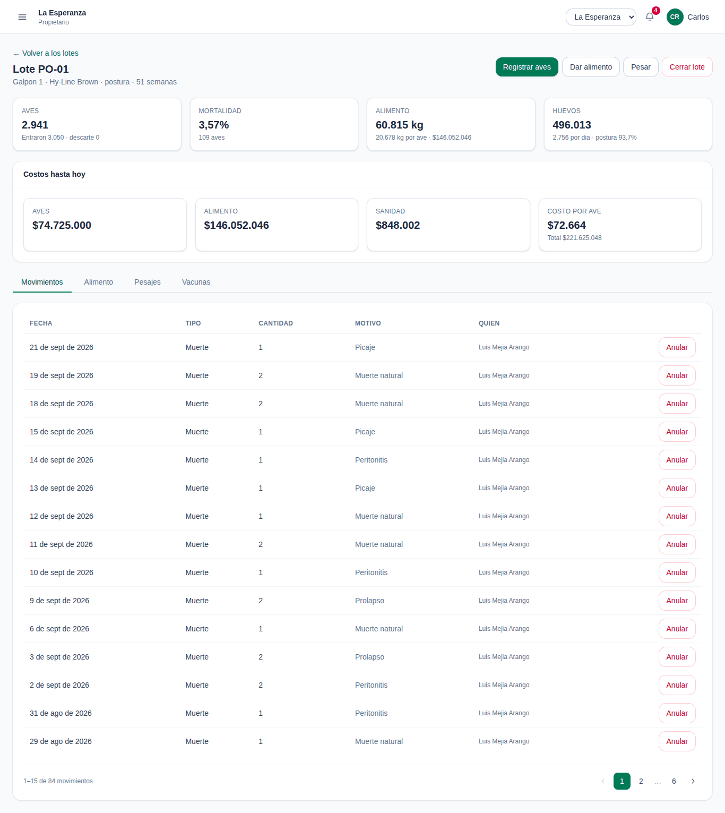

Arriba están los números del lote:

- **Aves:** vivas hoy, cuántas entraron y cuántas hay de descarte.
- **Mortalidad:** porcentaje y número de aves muertas.
- **Alimento:** kilos entregados, kilos por ave y costo.
- **Huevos:** total recolectado, promedio por día y porcentaje de postura.
- **Costos hasta hoy:** costo de las aves, del alimento y de la sanidad, y el **costo por ave**.

Abajo hay cuatro pestañas: **Movimientos**, **Alimento**, **Pesajes** y **Vacunas**.

#### Registrar aves (lo que les pasa)

Pulsa **Registrar aves** y elige **qué pasó**:

| Opción | Cuándo usarla | Qué hace |
|---|---|---|
| **Mortalidad** | Murieron aves | Las resta del lote |
| **Descarte** | Gallinas que dejaron de producir | Salen del conteo de producción y pasan a descarte; siguen en el galpón hasta venderse |
| **Venta de aves** | Se vendieron aves fuera de la caja | Las resta (primero de las de descarte) |
| **Fuga** / **Robo** / **Consumo en la finca** / **Regalo** | Según el caso | Las resta del lote |
| **Ingreso de más aves** | Llegaron aves para completar el lote | Las suma |
| **Traslado a otro galpón** | Todo el lote se pasa a otro galpón | Mueve el lote completo y actualiza la ocupación de ambos galpones |

Escribe la **fecha**, **cuántas aves** y el **motivo** (por ejemplo "golpe de calor", "prolapso").

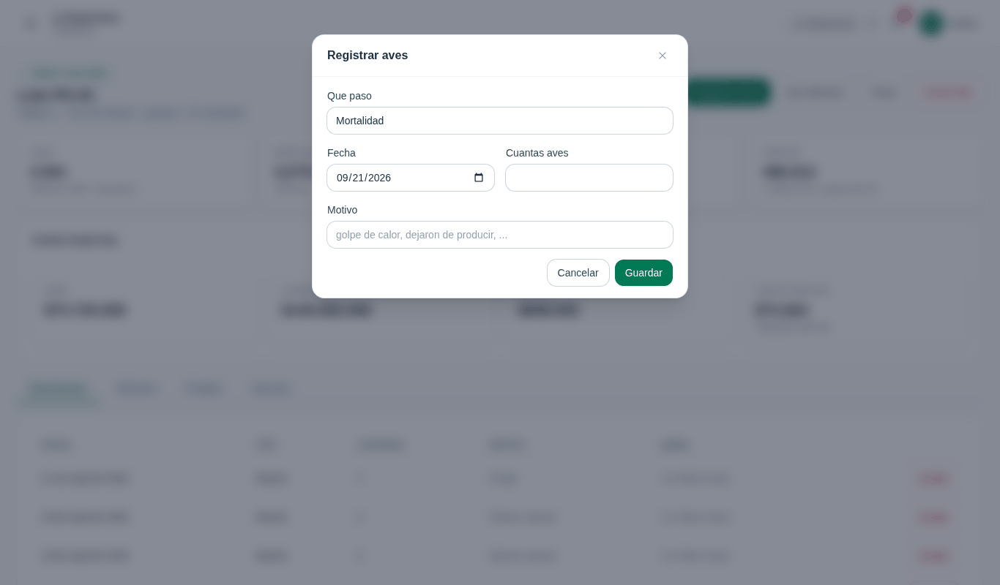

> Las ventas hechas en la **Caja** descuentan las aves solas; no hace falta registrarlas otra vez aquí.

#### Dar alimento

Pulsa **Dar alimento**, elige el **alimento**, la **bodega** de donde sale y la **cantidad en kilos**.
Se descuenta del inventario y suma al costo del lote. Si el alimento se maneja por bultos, el sistema
muestra la equivalencia.

#### Pesar

Pulsa **Pesar**, escribe cuántas aves pesaste (la muestra) y el peso total. El sistema calcula el
**peso promedio** por ave y la edad del lote ese día.

#### Anular un movimiento

Si un movimiento quedó mal, pulsa **Anular** en esa fila y escribe el motivo. Las aves vuelven a quedar
como estaban y el movimiento sigue en la lista, tachado, con el motivo.

#### Cerrar el lote

Cuando ya no quedan aves (todas se vendieron, murieron o se trasladaron), pulsa **Cerrar lote**. Un
lote cerrado no recibe más movimientos pero su historia se conserva para los reportes.

### 9.3 Producción de huevos

**Menú: Aves → Producción de huevos**

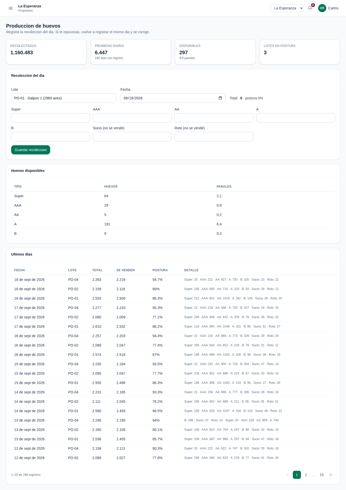

Arriba: huevos recolectados en total, promedio diario, huevos disponibles y lotes en postura.

#### Registrar la recolección del día

1. Elige el **lote** y la **fecha**.
2. Escribe cuántos huevos hubo de cada tipo: **Super, AAA, AA, A, B, Sucio y Roto**.
3. El sistema muestra el **total** y el **porcentaje de postura** (huevos ÷ gallinas en producción).
4. Pulsa **Guardar recolección**.

- Los tipos que se venden (Super a B) suman a los **huevos disponibles** de la finca. Los sucios y
  rotos se registran pero no se venden.
- **¿Te equivocaste?** Vuelve a registrar el mismo lote y el mismo día con los números correctos: el
  sistema corrige, no duplica.
- No se puede registrar producción de una fecha futura.

La tabla **Huevos disponibles** muestra cuántos hay de cada tipo y cuántos panales son. **Últimos días**
muestra cada registro con su total, lo que se vende, la postura y el detalle por tipo.

### 9.4 Vacunas y tratamientos

**Menú: Aves → Vacunas y tratamientos**

Arriba aparece un aviso azul con los **refuerzos próximos**. La lista muestra cada aplicación con su
fecha, tipo, producto, lote o galpón, vía, dosis, aves tratadas y fecha del próximo refuerzo.

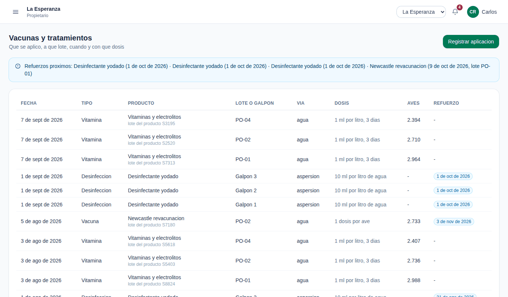

#### Registrar una aplicación

Pulsa **Registrar aplicacion** y llena:

| Campo | Qué poner |
|---|---|
| **Fecha** y **Tipo** | Vacuna, medicamento, vitamina, desinfección u otro |
| **Producto** | El nombre comercial, por ejemplo "Newcastle La Sota" |
| **Lote del producto** | El lote que trae el frasco (para rastrear) |
| **Lote de aves** o **Galpón** | A quién se le aplicó. Una desinfección se registra al galpón |
| **Vía** | Agua, ocular, aspersión, inyectado, alimento u otra |
| **Dosis** y **Aves tratadas** | Cuánto y a cuántas |
| **Próximo refuerzo** | Si hay que repetir, la fecha. El sistema avisará 7 días antes |
| **Descontar de la bodega** (opcional) | Elige el producto en bodega, la bodega y la cantidad usada para que se descuente del inventario y sume al costo del lote |

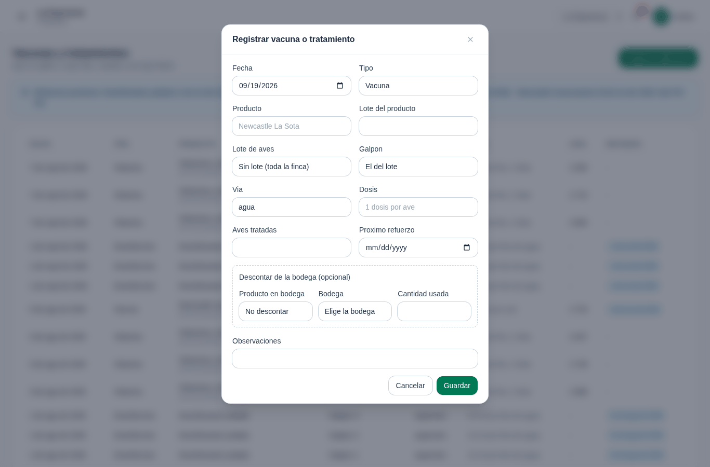

Cuando registras el refuerzo (el mismo producto o artículo al mismo lote o galpón), el aviso del
refuerzo anterior se cierra solo.

### 9.5 Sensores

**Menú: Aves → Sensores**

Muestra lo que miden los equipos en cada galpón. **Los datos llegan solos desde los sensores**; nadie
los escribe a mano. La pantalla se actualiza cada minuto.

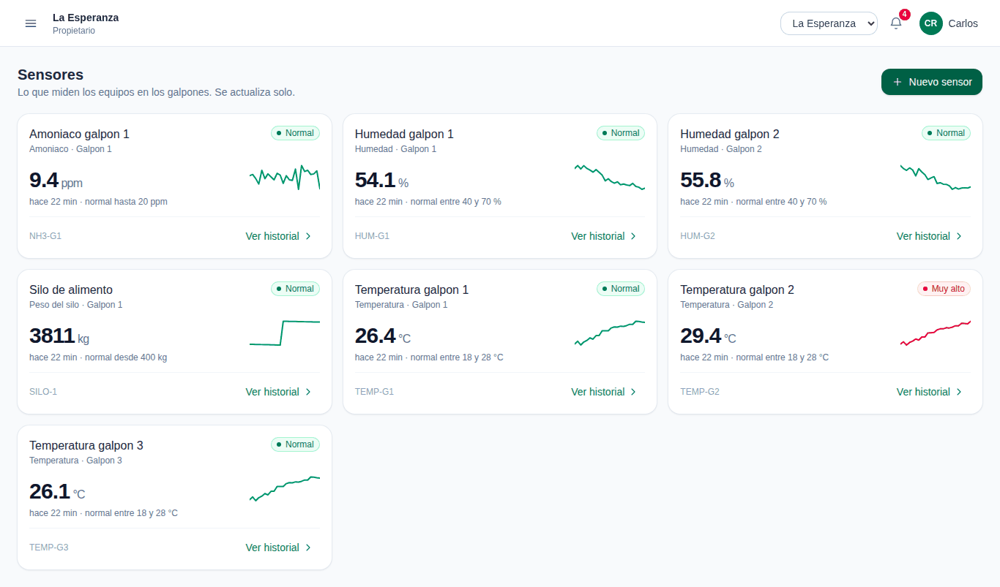

Cada tarjeta muestra:

- El **último valor** en grande con su unidad.
- El **estado**: **Normal** (verde), **Muy alto** (rojo), **Muy bajo** (ámbar) o **Sin datos**.
- Una **línea** con las últimas mediciones.
- Hace cuánto llegó la última medición y cuál es el **rango normal**.

Tipos que trae el sistema:

| Tipo | Unidad | Rango normal de fábrica |
|---|---|---|
| Temperatura | °C | 18 a 28 |
| Humedad | % | 40 a 70 |
| Amoníaco | ppm | hasta 20 |
| Dióxido de carbono | ppm | hasta 3.000 |
| Luz | lux | 5 a 60 |
| Consumo de agua | L | sin rango |
| Peso del silo | kg | sin rango (se puede poner un mínimo) |

Cada sensor puede tener su propio rango. Por ejemplo, un galpón de engorde con criadoras puede ir de 20
a 34 °C.

#### Ver el historial de un sensor

Pulsa **Ver historial** en la tarjeta.

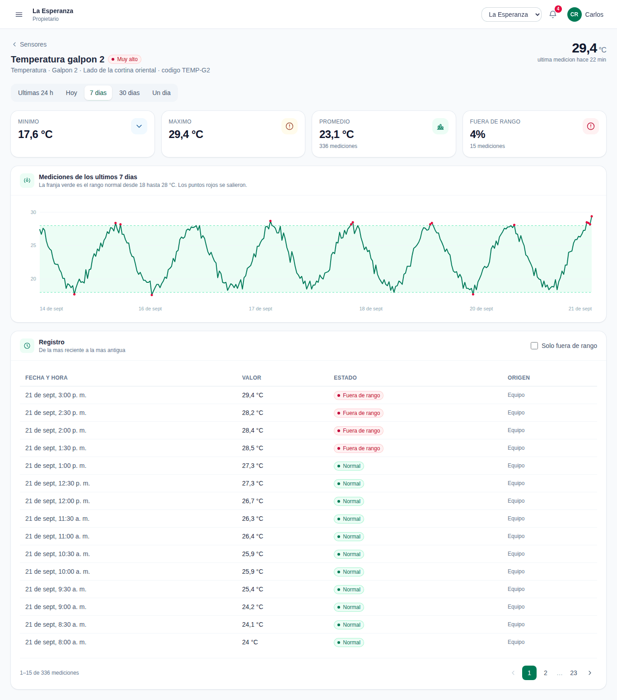

- Elige el periodo: **Últimas 24 h**, **Hoy**, **7 días**, **30 días** o **Un día** (con su fecha).
- Arriba: **mínimo**, **máximo**, **promedio** y **porcentaje fuera de rango** del periodo.
- La **gráfica** muestra la franja verde del rango normal; los puntos rojos son mediciones que se
  salieron. Pasa el mouse para ver el valor y la hora exacta.
- El **registro** lista las mediciones de la más reciente a la más antigua, por páginas. Marca **Solo
  fuera de rango** para ver únicamente las que se salieron.

#### Registrar un sensor nuevo

Pulsa **Nuevo sensor**, escribe su **código** (el mismo que tiene configurado el equipo), el nombre, qué
mide, el galpón, el rango normal y dónde está instalado. Desde ese momento el equipo puede enviar sus
mediciones al sistema (ver el README para la conexión técnica).

---

## 10. Operación

### 10.1 Tareas y rutinas

**Menú: Operación → Tareas**

Muestra las tareas del día elegido. Las pendientes arriba, con su prioridad (alta, media, baja), hora
y responsable; debajo, **Ya hechas**; y al final, las **Rutinas**.

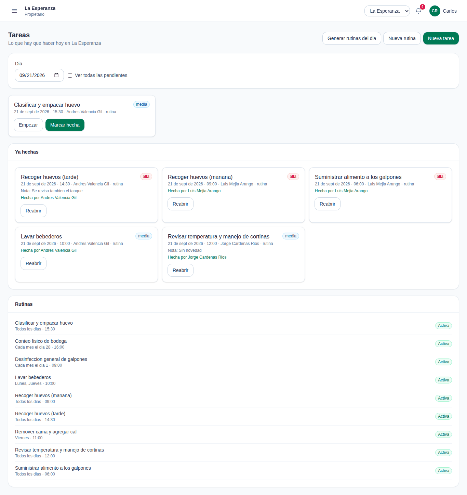

- **Empezar** marca la tarea *en proceso*; **Marcar hecha** la termina y guarda quién y a qué hora.
  **Reabrir** la devuelve a pendiente.
- **Ver todas las pendientes** muestra las pendientes de cualquier día.
- **Nueva tarea** (supervisor o administrador): título, descripción, fecha, hora, prioridad,
  responsable, galpón y lote.
- **Nueva rutina**: una tarea que se repite **todos los días**, **ciertos días de la semana** o **un día
  al mes**, con hora, prioridad y responsable.
- **Generar rutinas del día** crea las tareas de las rutinas para la fecha elegida. Si ya estaban
  creadas, no las duplica.

> El **operario** y el **cajero** solo ven **sus** tareas y solo pueden cambiarles el estado.

### 10.2 Novedades

**Menú: Operación → Novedades**

Todo lo que se sale de lo normal. Se filtra por **estado** (abierta, en proceso, cerrada) y por
**categoría**.

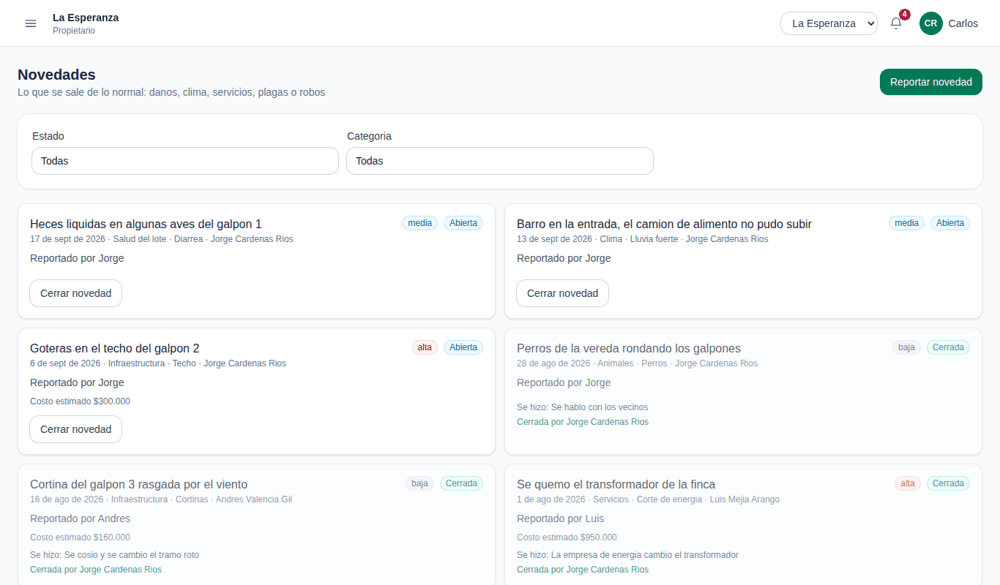

#### Reportar una novedad

Pulsa **Reportar novedad**:

| Campo | Qué poner |
|---|---|
| **Qué pasó** | Un título corto: "Se voló parte del techo del galpón 1" |
| **Fecha** y **Categoría** | Infraestructura, clima, animales (plagas, depredadores), servicios (luz, agua, internet), seguridad, salud del lote u otro |
| **Tipo** | Como lo llaman ustedes: vendaval, corte de energía, zarigüeya… |
| **Gravedad** | Baja, media o alta. Las **altas** aparecen en la campana hasta que se cierren |
| **Galpón** y **Lote** | Si aplica |
| **Detalle** | Lo que se vio |
| **Aves afectadas** | Si murieron aves, escribe cuántas y se **descuentan del lote** en el mismo registro |
| **Costo estimado** | Cuánto cuesta arreglarlo |
| **Qué se hizo o se va a hacer** | La acción tomada |

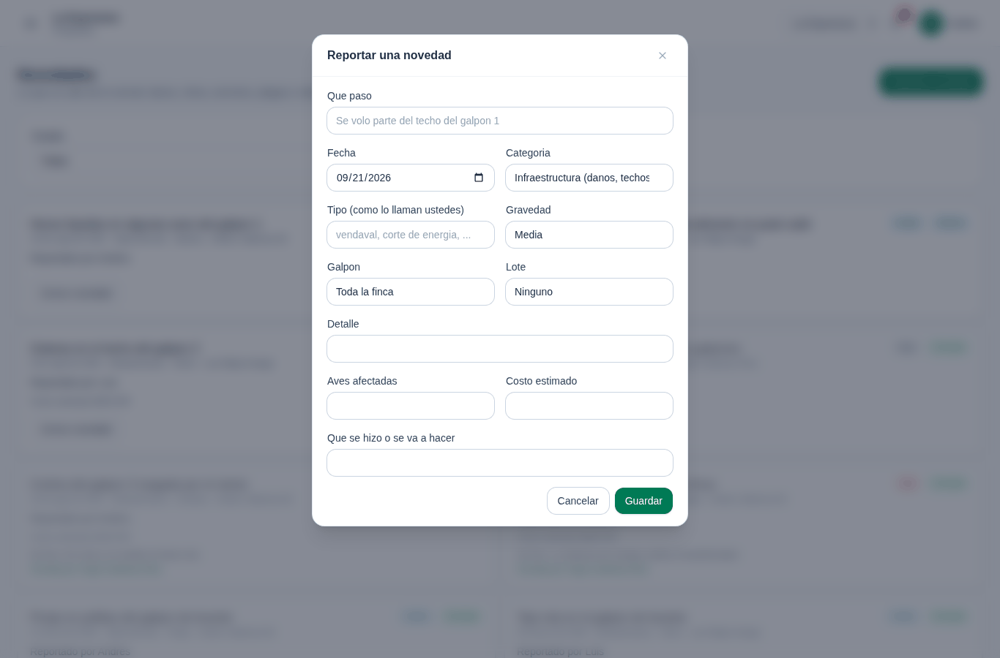

Cuando quede resuelta, pulsa **Cerrar novedad** y escribe qué se hizo.

### 10.3 Reportes

**Menú: Operación → Reportes**

Elige el periodo con **Desde** y **Hasta**, o con los botones **Última semana** y **Último mes**.

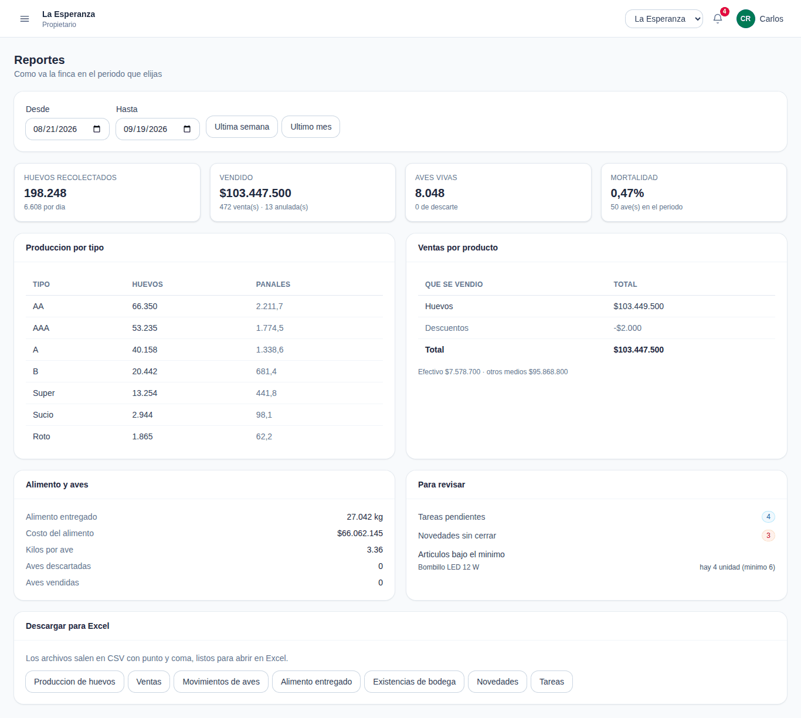

| Sección | Qué muestra |
|---|---|
| Resumen | Huevos recolectados y promedio diario, total vendido y número de ventas y anulaciones, aves vivas y de descarte, mortalidad del periodo |
| **Producción por tipo** | Huevos y panales de cada tipo |
| **Ventas por producto** | Lo vendido por clase (huevos, aves de descarte, engorde, otros), los descuentos, el total y cuánto fue en efectivo y en otros medios |
| **Alimento y aves** | Kilos entregados, costo del alimento, kilos por ave, aves descartadas y vendidas |
| **Para revisar** | Tareas pendientes, novedades sin cerrar y artículos bajo el mínimo |
| **Descargar para Excel** | Producción, ventas, movimientos de aves, alimento, existencias de bodega, novedades y tareas en archivos CSV que abren directo en Excel |

---

## 11. Inventario

### 11.1 Bodegas

**Menú: Inventario → Bodegas**

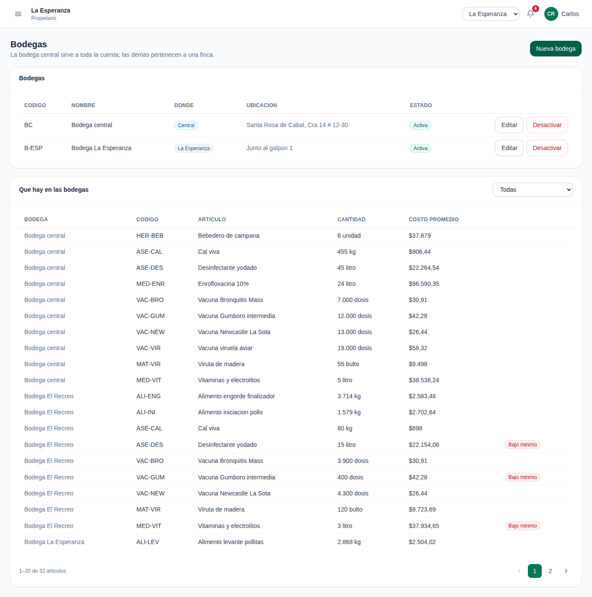

- **Nueva bodega:** código, nombre, ubicación y a qué finca pertenece. Si no se elige finca, es una
  bodega **central** que sirve a toda la cuenta.
- **Qué hay en las bodegas:** la cantidad y el costo promedio de cada artículo en cada bodega. Filtra
  por bodega con el selector. Los que están por debajo del mínimo se marcan **Bajo mínimo**.
- Una bodega que todavía tiene artículos no se puede desactivar.

### 11.2 Artículos

**Menú: Inventario → Artículos**

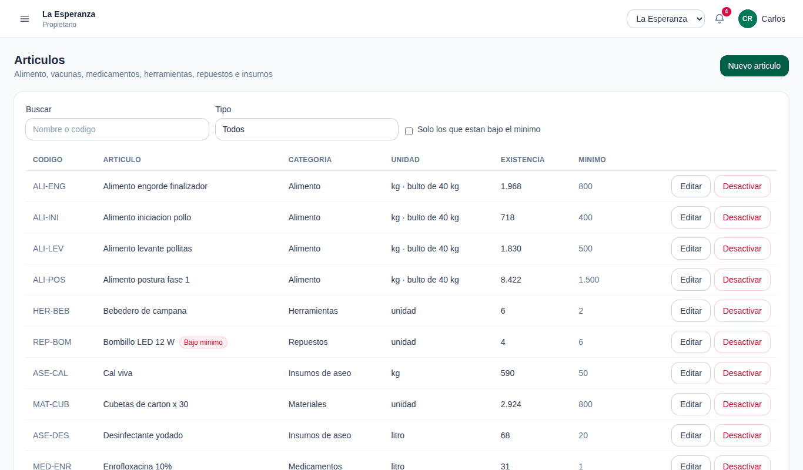

Cada artículo tiene **código**, **nombre**, **categoría** (alimento, vacunas, medicamentos,
herramientas, repuestos, insumos de aseo, materiales, otros), **unidad** (kg, unidad, litro, bulto,
dosis, metro), **kilos por bulto** si aplica y **stock mínimo**. La lista muestra la existencia total en
todas las bodegas.

> **Consejo:** pon un mínimo realista a todo lo que no puede faltar (alimento, vacunas, desinfectante,
> cubetas). Así la campana te avisa a tiempo.

### 11.3 Entradas y salidas

**Menú: Inventario → Entradas y salidas**

Es el kárdex: todo lo que entra, sale o se mueve. Se filtra por tipo, bodega y fechas. **Ver** muestra
el detalle de cada movimiento.

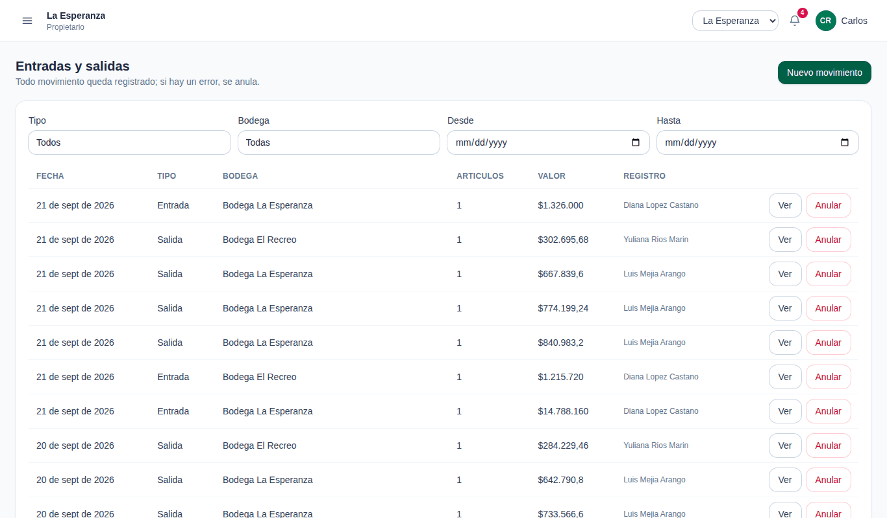

Pulsa **Nuevo movimiento** y elige qué vas a registrar:

| Tipo | Para qué | Qué pide |
|---|---|---|
| **Entrada** | Compra o recibo de artículos | Bodega, proveedor, factura o remisión, y por cada artículo: cantidad, costo unitario, lote y vencimiento (opcionales) |
| **Salida** | Consumo, pérdida o uso en la finca | Bodega, motivo y cantidades |
| **Traslado** | Mover artículos entre dos bodegas | Bodega de origen y de destino. El costo viaja con el artículo |
| **Ajuste por conteo** | Dejar la cantidad igual a lo que se contó | Bodega, motivo y la **cantidad contada** de cada artículo. El sistema calcula la diferencia |

Con **Agregar otro artículo** registras varios en el mismo movimiento.

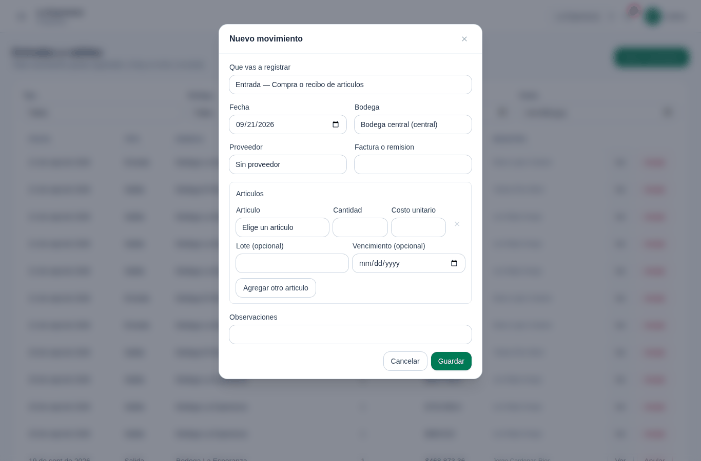

- **La existencia nunca queda en negativo:** si no hay suficiente, el movimiento no se guarda y el
  sistema dice cuánto hay.
- **Costo promedio:** cada entrada recalcula el costo promedio del artículo en esa bodega.
- **Anular:** un movimiento equivocado se anula con su motivo y las existencias vuelven como estaban.
  Si lo que entró ya se gastó, no se puede anular (quedaría en negativo).
- El alimento que se da a los lotes y las vacunas que se descuentan de bodega aparecen aquí como
  salidas automáticas.

### 11.4 Proveedores

**Menú: Inventario → Proveedores**

Nombre, documento (NIT o cédula), teléfono, correo y dirección de cada proveedor. Se eligen al
registrar una entrada. Un proveedor desactivado ya no aparece para nuevas compras.

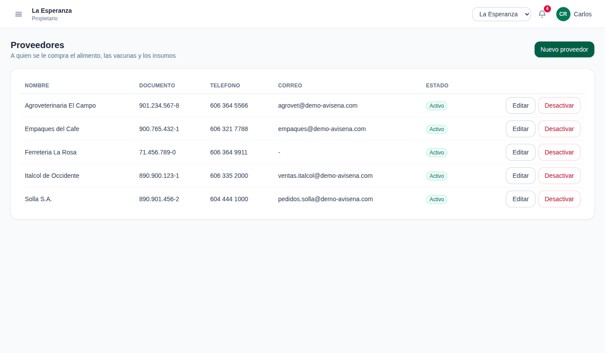

---

## 12. Ventas

### 12.1 Puntos de venta

**Menú: Ventas → Puntos de venta**

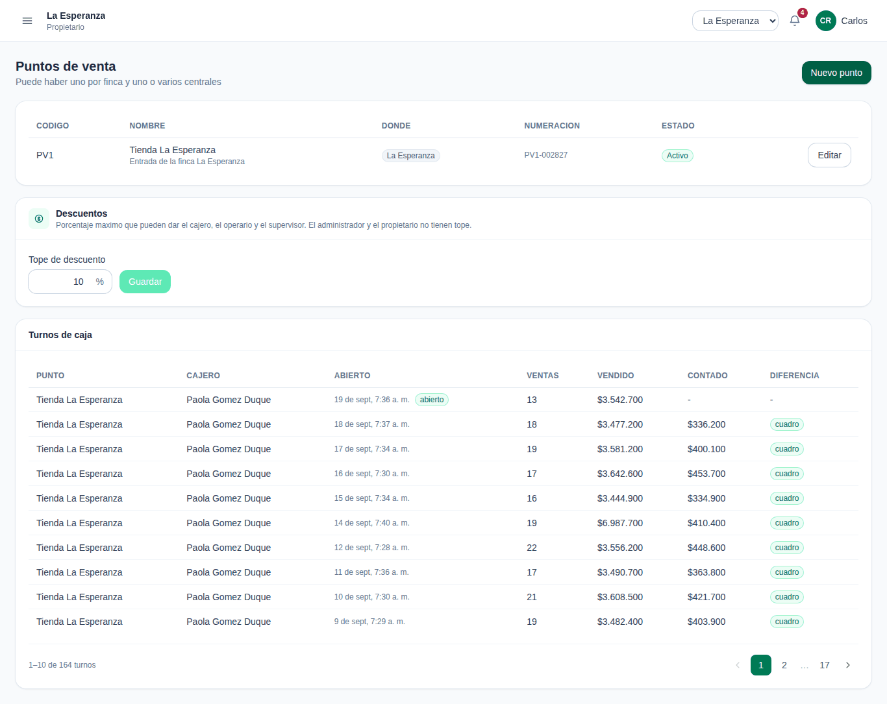

- Cada punto tiene **código**, **nombre**, dirección, **prefijo** y finca (o ninguna si es un punto
  central).
- Cada punto **numera sus ventas aparte**: `PV1-000123`, `PV2-000045`…
- **Descuentos:** el propietario y el administrador fijan aquí el **tope de descuento** en porcentaje
  para el cajero, el operario y el supervisor. Escribe el porcentaje y pulsa **Guardar**. El cambio
  aplica desde la siguiente venta.
- Abajo aparecen los **turnos de caja** con cajero, hora de apertura, número de ventas, total vendido,
  efectivo contado y diferencia (**cuadró**, faltante o sobrante).

### 12.2 Productos y precios

**Menú: Ventas → Productos y precios**

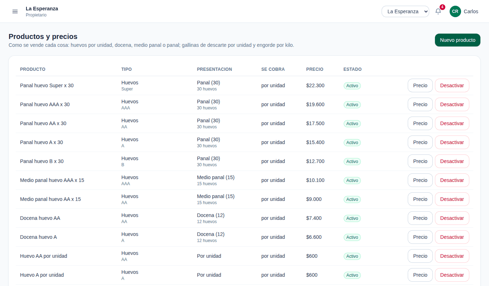

Un producto dice **cómo se vende** cada cosa:

| Clase | Presentaciones | Se cobra |
|---|---|---|
| **Huevos** (de un tipo: Super, AAA, AA, A o B) | Unidad (1), docena (12), medio panal (15), panal (30) | Por unidad |
| **Gallina de descarte** | — | Por unidad o por kilo |
| **Ave de engorde** | — | Por kilo |
| **Otro** (gallinaza, abono…) | — | Por unidad |

- **Precio** cambia el precio desde hoy. El precio anterior queda en el historial con su fecha.
- Un producto desactivado deja de aparecer en la caja.

### 12.3 Caja

**Menú: Ventas → Caja** (o **Abrir la caja** en el panel)

#### Abrir la caja

Elige el **punto de venta** y escribe la **base inicial** (el efectivo con el que empiezas). Pulsa
**Abrir caja**. Sin caja abierta no se puede vender.

#### Vender

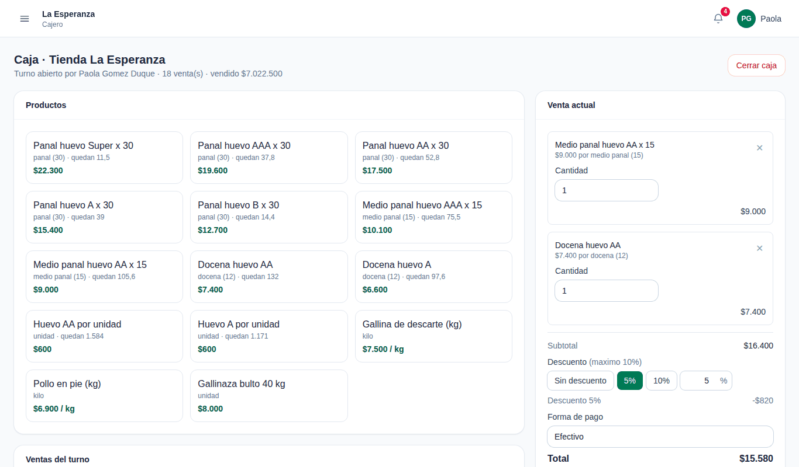

1. Toca los **productos** para agregarlos a la venta actual. Cada producto muestra su precio y cuánto
   queda disponible.
2. Ajusta la **cantidad** de cada línea. La **X** quita una línea.
3. **Descuento:** toca **5 %** o **10 %**, o escribe otro porcentaje en la casilla. El sistema calcula
   el valor en pesos y lo muestra debajo. Si no hay descuento, deja **Sin descuento**. Al lado dice el
   **máximo** que puedes dar.
4. Elige la **forma de pago**: efectivo, transferencia, tarjeta o crédito. Si no es efectivo, escribe
   la **referencia** (número de la transferencia, de la factura…).
5. Revisa el **total** y pulsa **Cobrar**.
6. Aparece el **recibo** con el número de venta, los productos, el descuento, el total y la forma de
   pago. Ciérralo con la X o dando clic afuera.

Detalles importantes:

- **Venta de huevos:** los huevos salen de los disponibles de la finca. Si no alcanzan, el sistema no
  deja vender y lo avisa.
- **Venta de aves** (descarte o engorde): al agregar el producto, elige el **lote** del que salen y
  cuántas **aves** son; si se cobra por kilo, la cantidad es el peso total. Las aves se descuentan del
  lote y del galpón automáticamente.
- **Tope de descuento:** si pasas el porcentaje permitido para tu rol, el sistema no guarda la venta y
  dice cuál es el máximo.

#### Ventas del turno

La lista **Ventas del turno** muestra número, hora, total, forma de pago y estado de cada venta, por
páginas. **Ver** abre el recibo.

#### Anular una venta

Pulsa **Anular**, escribe el motivo y confirma. Los huevos y las aves **vuelven** a donde estaban y la
venta queda marcada como anulada. El cajero **solo puede anular ventas de su turno abierto**; el
administrador puede anular cualquiera.

#### Estado de la caja y cierre

El recuadro **Estado de la caja** muestra la base, lo vendido, lo recibido en efectivo y cuánto **debe
haber en caja**.

Al terminar la jornada:

1. Pulsa **Cerrar caja**.
2. Cuenta el efectivo y escribe el **efectivo contado**.
3. Pulsa **Cerrar caja**. El sistema guarda la **diferencia** (faltante o sobrante) y el turno queda
   cerrado.

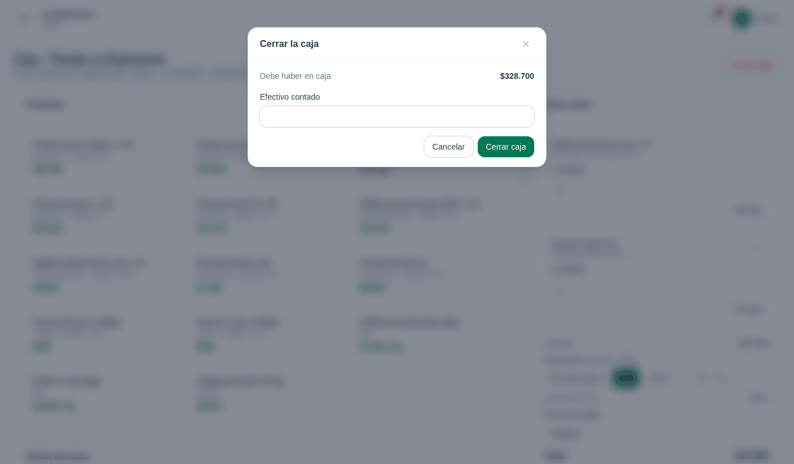

Si una caja queda abierta de un día para otro, aparece un aviso en la campana.

---

## 13. Organización

### 13.1 Fincas

**Menú: Organización → Fincas**

Código, nombre, municipio, departamento, dirección y teléfono de cada finca de la cuenta.

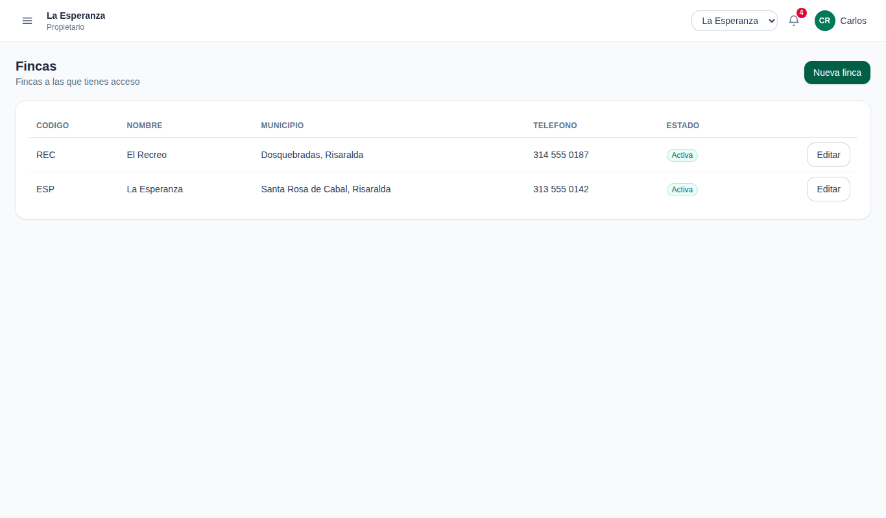

### 13.2 Galpones

**Menú: Organización → Galpones**

Código, nombre, tipo (postura, levante, engorde o cría), capacidad y observaciones de cada galpón de la
finca activa. La columna **Aves** muestra la ocupación actual, que el sistema mantiene al día con los
lotes. Un galpón con aves no se puede desactivar.

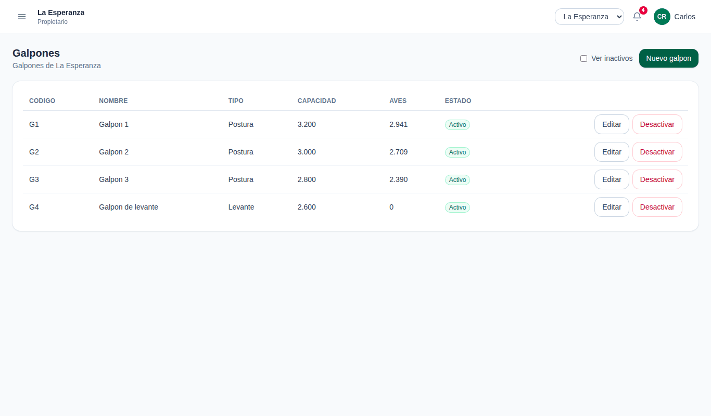

### 13.3 Usuarios

**Menú: Organización → Usuarios**

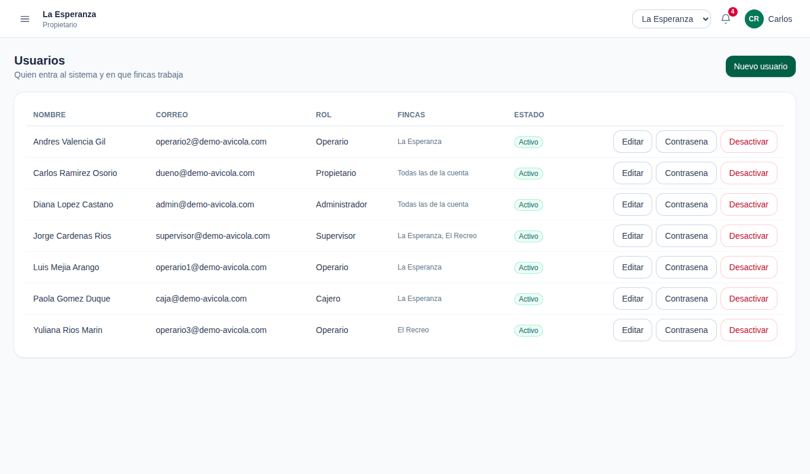

#### Crear un usuario

1. Pulsa **Nuevo usuario**.
2. Escribe nombres, apellidos, correo, documento y teléfono.
3. Elige el **rol**.
4. Para supervisores, operarios y cajeros, marca las **fincas** donde trabaja. Una finca puede quedar
   como **solo consulta**.
5. Escribe una **contraseña temporal** (mínimo 8 caracteres). El usuario la cambiará al entrar.

#### Otras acciones

- **Editar:** cambia datos, rol o fincas.
- **Contraseña:** asigna una nueva contraseña temporal (para quien la olvidó).
- **Desactivar:** el usuario ya no puede entrar, pero todo lo que registró se conserva con su nombre.

### 13.4 Roles y permisos

**Menú: Organización → Roles y permisos**

Una tabla por rol con cada módulo y cuatro casillas: **Ver**, **Crear**, **Editar** y **Borrar**.
Los cambios se guardan al instante y aplican desde la siguiente acción de cada usuario.

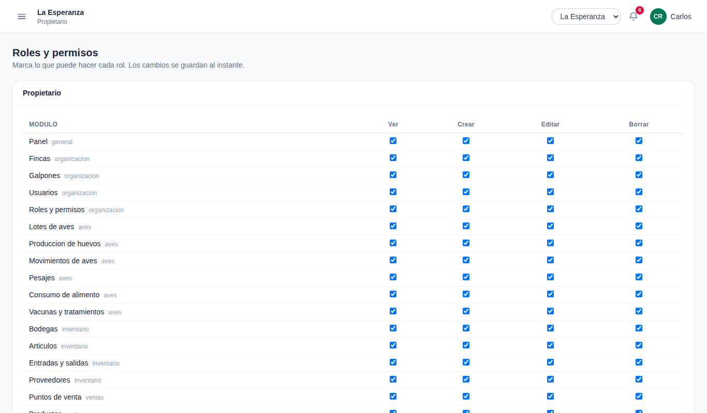

> El sistema valida los permisos en el servidor en cada operación: aunque alguien conozca la dirección
> de una pantalla, no puede hacer lo que su rol no permite.

### 13.5 Cuentas (solo plataforma)

El usuario de **plataforma** administra las cuentas de todas las granjas: crea cuentas nuevas (empresa o
persona) con su documento y datos de contacto, les crea fincas y su primer usuario propietario, y puede
desactivar una cuenta.

---

## 14. Sistema

### 14.1 Importar desde Excel

**Menú: Sistema → Importar desde Excel**

Sirve para subir información que ya tienes en Excel, **sin cambiarle el formato**.

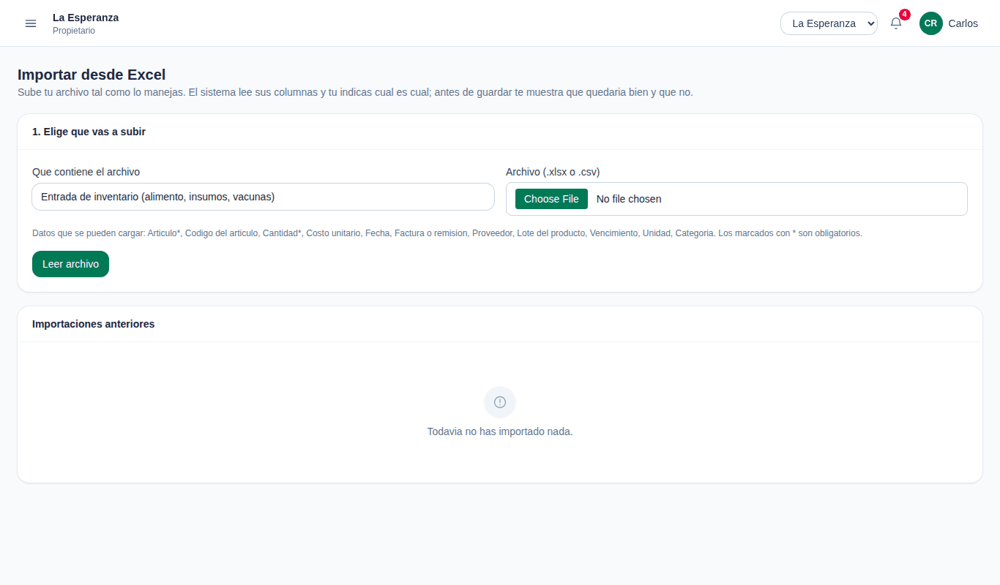

Qué se puede importar:

- Artículos del inventario
- Entrada de inventario (alimento, insumos, vacunas)
- Proveedores
- Vacunas y tratamientos aplicados
- Producción de huevos

Pasos:

1. **Elige qué contiene el archivo** y sube el `.xlsx` o `.csv` (hasta 5 MB y 5.000 filas). La pantalla
   dice qué datos se pueden cargar y cuáles son obligatorios (marcados con \*).
2. Pulsa **Leer archivo**. El sistema salta los títulos sueltos de arriba, encuentra el encabezado y
   reconoce nombres de columna distintos (`CÓDIGO`, `DESCRIPCIÓN DEL PRODUCTO`, `VR UNITARIO`, `UND`…).
3. **Empareja las columnas:** para cada dato del sistema elige la columna de tu archivo. Lo que se
   reconoció ya viene marcado. Si vas a subir el mismo formato otras veces, **guárdalo como plantilla**.
4. **Revisa:** el sistema muestra cuántas filas quedan listas y cuáles tienen problemas, con el motivo
   de cada una. Todavía no se ha guardado nada.
5. Pulsa **Guardar** para cargar las filas buenas.
6. La importación queda en **Importaciones anteriores**. Si algo salió mal, **Deshacer** la revierte:
   las entradas de inventario se anulan, la producción se resta de los disponibles y los artículos
   creados quedan desactivados.

El sistema entiende fechas en varios formatos, números con punto o coma (`1.234,56`) y unidades escritas
de muchas formas (`kg`, `kilos`, `und`, `bultos`).

### 14.2 Registro de cambios

**Menú: Sistema → Registro de cambios**

Cada operación importante queda guardada con **fecha y hora**, **usuario**, **acción** (crear, editar,
anular, entrar…), **qué se tocó** y el **detalle**. Se puede filtrar por tipo. Sirve para saber quién
hizo qué y cuándo.

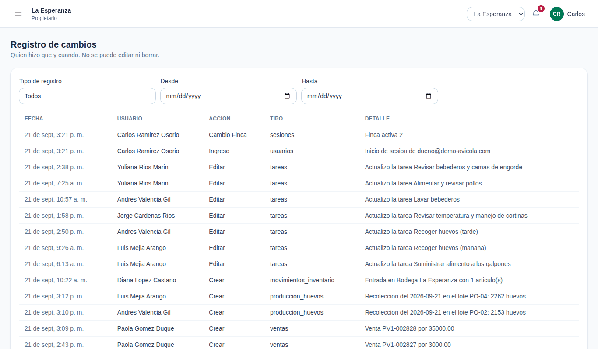

### 14.3 Mi cuenta

**Menú del usuario → Mi cuenta**

Muestra tus datos (nombre, correo, rol, cuenta y fincas) y te deja **cambiar la contraseña**: escribe la
actual, la nueva dos veces y pulsa **Guardar**.

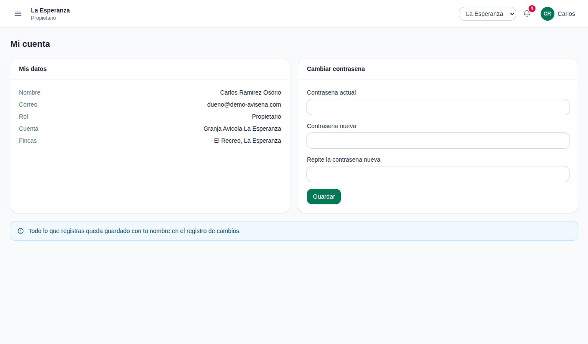

---

## 15. Usar Avícola desde el celular

Todas las pantallas se acomodan al celular. El menú se abre con **☰** y se cierra al elegir una opción
o tocando afuera.

| Panel en el celular | Menú en el celular |
|---|---|
| 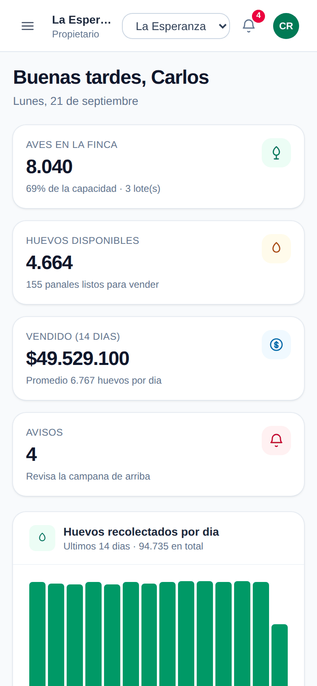 | 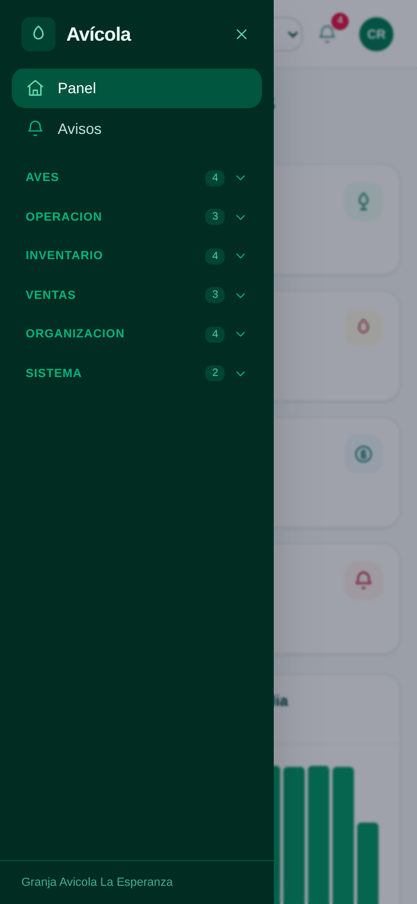 |

### Instalarla como aplicación

- **Android (Chrome):** abre Avícola, toca los tres puntos del navegador y elige **Instalar aplicación**
  o **Agregar a la pantalla principal**.
- **iPhone (Safari):** toca **Compartir** y luego **Agregar a pantalla de inicio**.

Queda con su ícono y abre sin la barra del navegador, como cualquier aplicación.

---

## 16. El día a día según el rol

### Operario

1. **Temprano:** abre **Tareas** y revisa lo que te toca hoy.
2. Al dar de comer: **Lotes → Abrir → Dar alimento** (lote, bodega y kilos).
3. Si hay aves muertas: **Registrar aves → Mortalidad** con el motivo.
4. Después de recoger: **Producción de huevos** con los huevos de cada tipo, lote por lote.
5. Si aplicas una vacuna o vitamina: **Vacunas y tratamientos → Registrar aplicación**.
6. Si algo se daña o pasa algo raro: **Novedades → Reportar novedad**.
7. Marca cada tarea como **hecha** al terminarla.

### Cajero

1. **Caja → Abrir caja** con la base del día.
2. Vende tocando los productos, aplica el descuento si corresponde y cobra.
3. Si te equivocas en una venta de tu turno: **Anular** con el motivo y vuelve a registrarla.
4. Al final del día: cuenta el efectivo y **Cerrar caja**.

### Supervisor

1. Revisa el **Panel** y la **campana**: tareas atrasadas, sensores fuera de rango, refuerzos y
   artículos por acabarse.
2. Revisa **Sensores**, sobre todo en las horas de más calor.
3. Crea o reasigna **tareas** y genera las **rutinas** si no se generaron.
4. Registra traslados, descartes, pesajes y vacunas.
5. Cierra las **novedades** resueltas.
6. Haz el **ajuste por conteo** de la bodega cuando toque.

### Administrador y propietario

1. **Semanalmente:** revisa **Reportes** (producción, ventas, mortalidad, costo del alimento).
2. Registra las **compras** en **Entradas y salidas** y los **traslados** de la bodega central a las
   fincas.
3. Actualiza los **precios** cuando cambien.
4. Revisa los **turnos de caja** en **Puntos de venta** (diferencias de efectivo).
5. Mantiene los **usuarios** al día (altas, bajas y contraseñas).
6. Revisa el **Registro de cambios** cuando necesite saber quién hizo algo.

---

## 17. Reglas que el sistema cuida por ti

- **Nada queda en negativo:** ni las existencias de bodega, ni las aves de un lote, ni los huevos
  disponibles.
- **Nada se borra, se anula:** ventas, movimientos de inventario y de aves quedan en el historial con el
  motivo, quién y cuándo.
- **Cada cuenta ve solo lo suyo**, y cada persona ve solo las fincas que tiene asignadas.
- **Los galpones no se llenan de más:** no se puede pasar de la capacidad.
- **La producción no se duplica:** registrar el mismo lote y día corrige el registro anterior.
- **Las rutinas no se duplican** al generarlas otra vez.
- **Los pagos cuadran:** la suma de las formas de pago debe ser igual al total de la venta.
- **Los avisos se cierran solos** cuando el problema se resuelve.
- **Todo queda firmado:** cada registro guarda quién lo hizo.

---

## 18. Preguntas frecuentes y problemas comunes

**No veo una opción del menú.**
Tu rol no tiene permiso para esa pantalla. Pídele al propietario que lo revise en **Roles y permisos**.

**Registré algo en la finca equivocada.**
Anula el registro, cambia la finca activa arriba y vuelve a registrarlo.

**Me equivoqué en la recolección de huevos.**
Vuelve a registrar el mismo lote y la misma fecha con los números correctos; se corrige solo.

**Me equivoqué en una venta.**
Anúlala con el motivo (solo si es de tu turno abierto, si eres cajero) y regístrala de nuevo.

**El sistema dice "No hay suficiente…".**
En la bodega no hay la cantidad que intentas sacar. Revisa **Bodegas → Qué hay en las bodegas**;
quizás falta registrar una compra o un traslado.

**El sistema dice "No hay esa cantidad de huevos disponibles".**
Falta registrar la recolección del día o ya se vendieron. Revisa **Producción de huevos → Huevos
disponibles**.

**No me deja cerrar el lote.**
Todavía quedan aves (vivas o de descarte). Regístralas como venta, mortalidad o traslado antes de
cerrar.

**No me deja anular un movimiento de bodega.**
Lo que entró con ese movimiento ya se usó; anularlo dejaría la bodega en negativo. Registra un ajuste
por conteo si hace falta corregir.

**Un sensor dice "Sin datos".**
El equipo no ha enviado mediciones. Revisa que esté encendido, con conexión, y que su código coincida
con el registrado en Avícola.

**El descuento no pasa.**
Superaste el tope de descuento de tu rol. El mensaje dice cuál es el máximo.

**La campana sigue avisando algo que ya resolví.**
Los avisos se recalculan cada vez que abres la campana o la pantalla de avisos. Si el problema de verdad
se resolvió (se compró el artículo, se hizo la tarea, se cerró la novedad), desaparece. **Marcar como
vistos** solo apaga el número.

**Olvidé mi contraseña.**
Pídele al administrador que te asigne una nueva en **Usuarios → Contraseña**.

---

## 19. Glosario

| Palabra | Significado |
|---|---|
| **Postura** | Producción de huevos. Porcentaje de postura = huevos del día ÷ gallinas en producción × 100 |
| **Levante** | Etapa de crianza de las pollitas antes de empezar a poner |
| **Engorde** | Pollos criados para carne |
| **Descarte / salvamento** | Gallinas que ya no producen y se venden |
| **Panal** | Cubeta de 30 huevos. Medio panal = 15 |
| **Kárdex** | Historial de entradas y salidas de un artículo |
| **Costo promedio** | Costo por unidad de lo que hay en bodega, ponderado con cada compra |
| **Ajuste por conteo** | Corrección del inventario para que coincida con lo que se contó físicamente |
| **Turno** | Periodo entre abrir y cerrar la caja |
| **Base** | Efectivo con el que se abre la caja |
| **Refuerzo** | Nueva aplicación de una vacuna o tratamiento en la fecha indicada |
| **Rango normal** | Valores entre los que una medición de sensor se considera correcta |
| **ppm** | Partes por millón (medida de gases como el amoníaco) |
| **Finca activa** | La finca en la que estás trabajando en este momento |

---

*Avícola — Manual de usuario.*
